> **目标:** 快速搭建环境,掌握库表操作
>
> ps:最近一个月有点忙，专栏搁置了会，后续尽可能保证一周一更

***

## 开篇:安装不是重点,会用才是关键

上一讲咱们把MySQL和Excel的关系搞清楚了。今天要动手了——创建数据库、建表、插数据、查数据。

安装MySQL不是本文重点,我会给你最快的方式搞定环境。重点是后面的操作,这才是你需要掌握的核心技能。

***

## 一、5分钟搞定MySQL环境

### 推荐方案:Docker(一行命令搞定，推荐，全平台通用)

如果你的电脑装了Docker,这是最快的方式:

> 没装Docker？先花2分钟搞定：\
> Windows/Mac：装Docker Desktop（官网下载，一路下一步，启动后等图标变绿）；\
> Linux：`sudo apt install docker.io -y && sudo systemctl start docker`

如果你的电脑装了Docker,这是最快的方式:

```bash
docker run -d --name mysql8 -p 3306:3306 -e MYSQL_ROOT_PASSWORD=your_password mysql:8.0
```

登录MySQL:

```bash
docker exec -it mysql8 mysql -u root -p
```

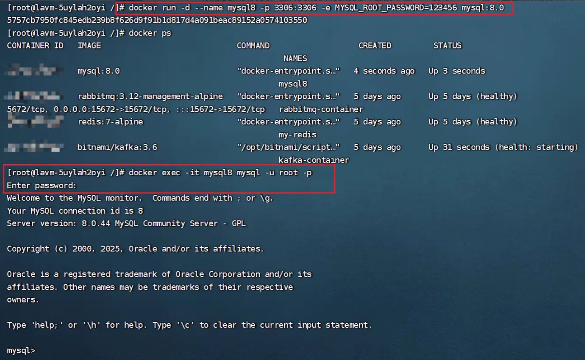

没装Docker?往下看👇

### Windows本地安装

**下载MySQL：**

1.  访问：<https://dev.mysql.com/downloads/mysql/>
2.  选择：Windows (x86, 64-bit), ZIP Archive
3.  点击 Download 下载（无需登录，点击"No thanks, just start my download"）
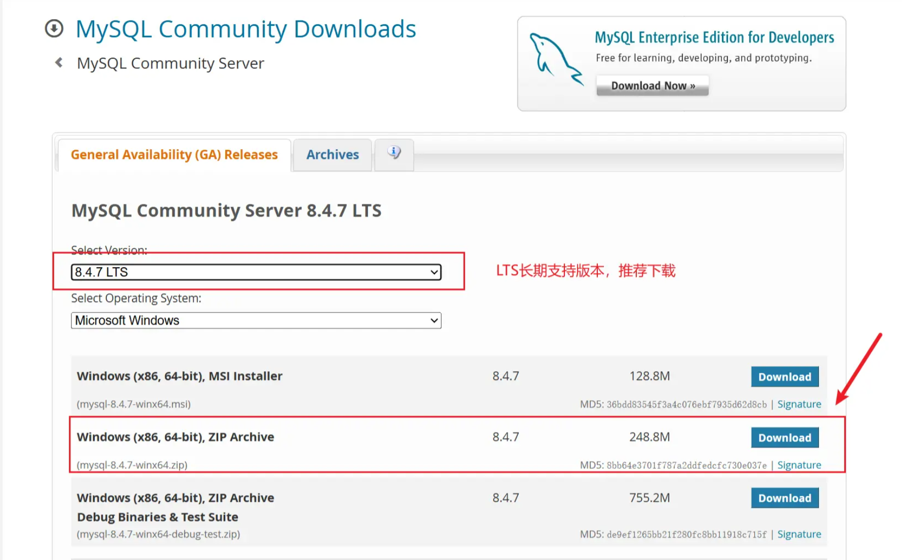

下载好后，进行后续操作

4.  解压到D盘根目录（比如D:\mysql-8.4.7，路径别带中文/空格，解压后能直接看到`bin`文件夹即可）
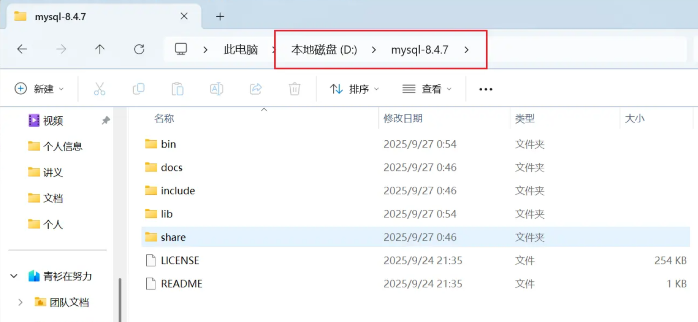

5.  新建配置文件 my.ini（MySQL 的 “启动说明书”）

*   操作：在 `D:\mysql-8.4.7` 目录右键→新建文本文档→重命名为 `my.ini`（后缀改.ini，不是.txt）。

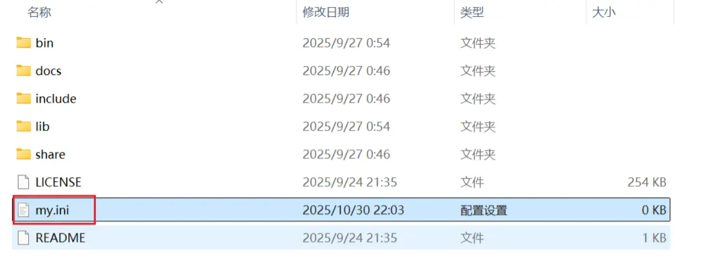

*   复制以下内容（改路径为你的解压路径）：
    ```ini
    [mysqld]
    basedir=D:\mysql-8.4.7  # 解压路径
    datadir=D:\mysql-8.4.7\data  # 自动生成数据目录
    port=3306  # 默认端口，占用可改3307
    character-set-server=utf8mb4  # 支持中文
    ```
*   避坑：记事本保存时，“编码”选「UTF-8 无BOM格式」。

6.  管理员身份打开 CMD（没这步，后面全报错）

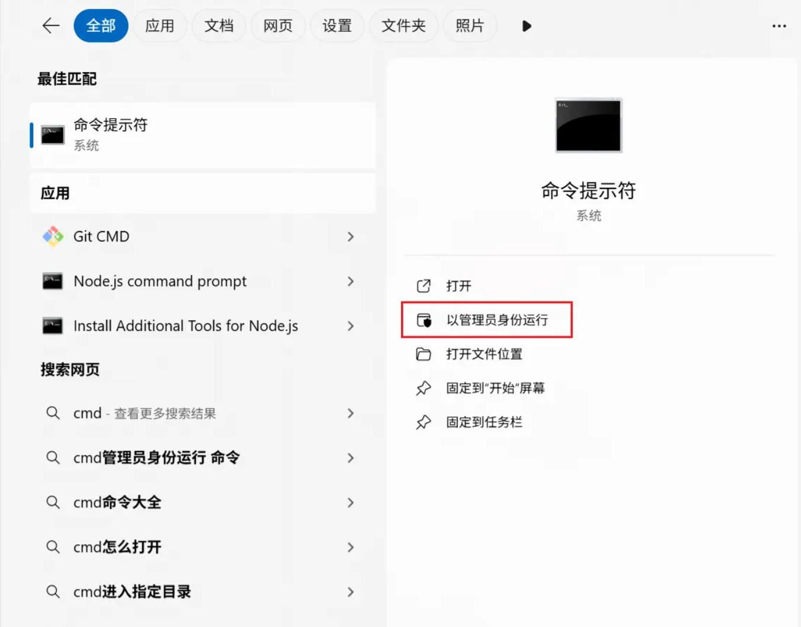

7.  进入 MySQL 的 bin 目录（告诉 CMD 要操作哪个程序）

```cmd
D:
cd D:\mysql-8.4.7\bin
```
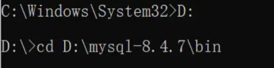

8.  初始化 MySQL（生成临时密码，记死这步！）

```cmd
 mysqld --initialize --console
```

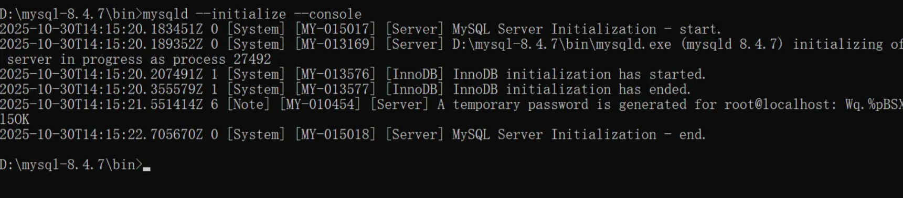

*   关键：最后几行找「root\@localhost: 密码」，红框标出来并记在记事本（含特殊符号）。
*   避坑：若提示“mysqld不是内部命令”，检查第5步路径是否输错。

9.  装服务+启动服务

*   装服务命令：
    ```cmd
    mysqld --install MySQL
    ```
    成功提示：`Service successfully installed`。
*   启动服务命令：
    ```cmd
    net start MySQL
    ```
    成功提示：`MySQL服务已经启动成功`。


10. 登录+改密码 Wq.%pBSXl5OK

*   登录命令：
    ```cmd
    mysql -u root -p
    ```
    粘贴步骤6记的临时密码（CMD右键粘贴，不显示内容，回车即可）。
*   改密码命令（把123456换成你的密码）：
    ```sql
    ALTER USER 'root'@'localhost' IDENTIFIED BY '123456';
    ```
*   验证：出现 `Query OK` 且提示符变为 `mysql>`，登录成功。

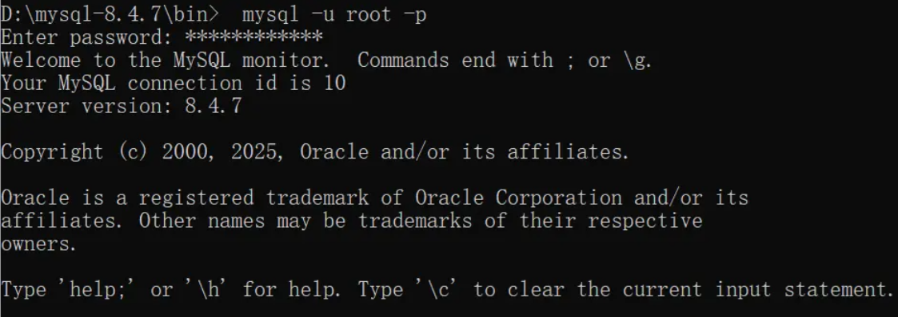

11. 验证安装

*   命令：
    ```sql
    SELECT VERSION();
    ```
*   结果：显示版本号（如8.4.7），搞定！

3个高频坑速查

| 问题                  | 解决办法                                     |
| ------------------- | ---------------------------------------- |
| 初始化找不到临时密码          | 打开`data`目录下「计算机名.err」，搜“root\@localhost” |
| 登录提示“Access denied” | 临时密码输错，重新找；或用新密码登录                       |

**Mac用户:** 下载DMG安装包或用Homebrew,参考官方文档:<https://dev.mysql.com/doc/refman/8.0/en/macos-installation.html>

***

## 二、选个趁手的工具

有两个选择:命令行或Navicat。

### 命令行:高效但不直观

登录:`mysql -u root -p`
退出:`exit`

优点:轻量快速,适合写脚本。
缺点:不直观,刚开始容易打错。

### Navicat:新手友好,界面清爽

下载地址:<https://www.navicat.com.cn/> (有试用版，如果可以还是支持下正版)，一直下一步就好，安装到D盘

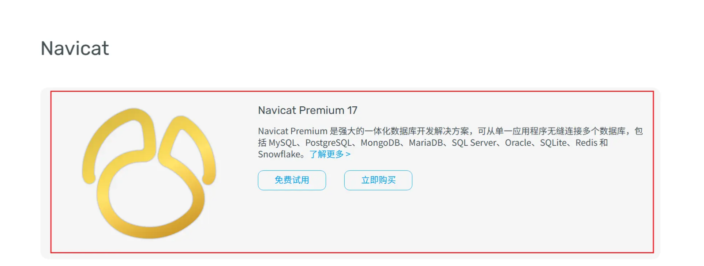

连接配置:

*   主机:localhost
*   端口:3306
*   用户名:root
*   密码:你设置的密码

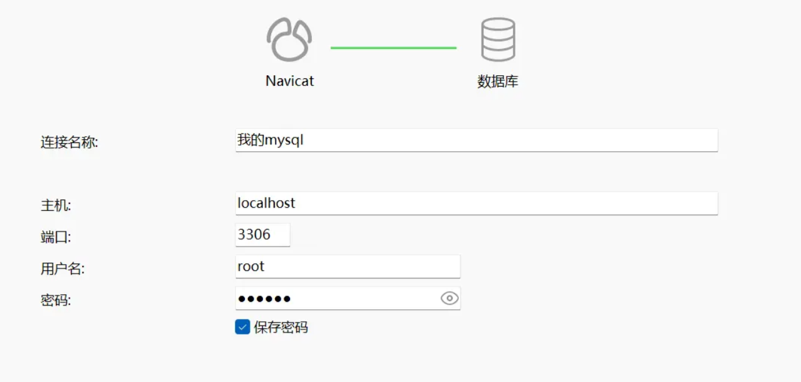

**建议:** 新手直接上Navicat。

***

## 三、实战:创建员工管理数据库(DDL核心操作)

环境搞定了,开始干正事。

### 场景需求

公司要做个员工管理系统,需要存:

*   员工工号、姓名、部门、薪资、入职时间

### 操作1:创建数据库

```sql
CREATE DATABASE IF NOT EXISTS company_db;
```

`IF NOT EXISTS`是个好习惯,避免重复创建报错。

查看所有数据库:

```sql
SHOW DATABASES;
```

你会看到:

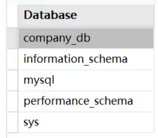

`company_db`就是咱们刚创建的,其他几个是MySQL自带的系统库,别乱动。

### 操作2:使用数据库

```sql
USE company_db;
```

### 操作3:创建员工表(重点)

```sql
CREATE TABLE IF NOT EXISTS employee (
    id INT AUTO_INCREMENT PRIMARY KEY COMMENT '员工工号',
    name VARCHAR(50) NOT NULL COMMENT '姓名',
    department VARCHAR(30) NOT NULL COMMENT '部门',
    salary DECIMAL(10, 2) NOT NULL COMMENT '薪资',
    hire_date DATE NOT NULL COMMENT '入职时间'
) ENGINE=InnoDB DEFAULT CHARSET=utf8mb4 COMMENT='员工表';
```

**逐行解释:**

| 字段定义                                | 含义               | 为什么这么写                          |
| ----------------------------------- | ---------------- | ------------------------------- |
| `id INT AUTO_INCREMENT PRIMARY KEY` | 整数、自增、主键         | 自增省得手动填,主键保证唯一                  |
| `name VARCHAR(50) NOT NULL`         | 可变字符串、最多50字符、不能空 | 姓名长度不固定,必须填                     |
| `department VARCHAR(30) NOT NULL`   | 可变字符串、最多30字符     | 部门名长度不固定                        |
| `salary DECIMAL(10, 2) NOT NULL`    | 精确小数、10位2位小数     | **存钱必须用DECIMAL,不能用FLOAT**(会丢精度) |
| `hire_date DATE NOT NULL`           | 日期类型             | 格式:2024-01-15                   |

**表级选项:**

*   `ENGINE=InnoDB`:支持事务(后面会讲)
*   `DEFAULT CHARSET=utf8mb4`:支持中文、emoji、生僻字
*   `COMMENT`:给表和字段加注释,方便以后看懂

### 操作4:查看表结构

```sql
DESC employee;
```

Key列的PRI表示主键,Extra列的auto\_increment表示自增。

***

## 四、插入和查询数据(DML基础操作)

表建好了,开始往里塞数据。

### 插入数据:INSERT

```sql
-- 单条插入
INSERT INTO employee (name, department, salary, hire_date) 
VALUES ('张三', '技术部', 8000.00, '2023-01-15');

-- 批量插入(推荐,效率高)
INSERT INTO employee (name, department, salary, hire_date) VALUES
('李四', '市场部', 6000.00, '2023-03-20'),
('王五', '技术部', 9000.00, '2022-11-10'),
('赵六', '人力部', 7000.00, '2023-05-01'),
('孙七', '技术部', 8500.00, '2023-02-14');
```

**注意:** 我们没填id,因为它是AUTO\_INCREMENT,MySQL会自动分配。

### 查询数据:SELECT

```sql
-- 查询所有数据
SELECT * FROM employee;

-- 只查特定字段
SELECT name, salary FROM employee;

-- 条件查询:查技术部员工
SELECT * FROM employee WHERE department = '技术部';

-- 条件查询:查薪资>8000的
SELECT * FROM employee WHERE salary > 8000;

-- 排序:按薪资降序
SELECT * FROM employee ORDER BY salary DESC;

-- 限制数量:只看前3条
SELECT * FROM employee LIMIT 3;
```

***

## 五、字段类型速查表(重要)

建表时最常用的类型,记住这些就够了:

### 数字类型

| 类型           | 范围/说明     | 什么时候用      | 避坑提示                |
| ------------ | --------- | ---------- | ------------------- |
| INT          | -21亿\~21亿 | 主键、数量、年龄   | 最常用的整数类型            |
| BIGINT       | 超大数字      | 订单号(超过21亿) | 数值特别大时用             |
| DECIMAL(M,D) | 精确小数      | **金额、工资**  | **存钱必须用这个,别用FLOAT** |
| TINYINT      | -128\~127 | 性别(0/1)、状态 | 节省空间                |

**避坑:**

*   手机号用VARCHAR(11),不用BIGINT(有前导0)
*   布尔值用TINYINT(0/1),MySQL没有真正的BOOLEAN

### 字符串类型

| 类型         | 说明        | 什么时候用                       |
| ---------- | --------- | --------------------------- |
| VARCHAR(N) | 可变长度      | 姓名、地址、描述(最常用)               |
| CHAR(N)    | 定长        | 身份证号(18位)、手机号(11位)、MD5(32位) |
| TEXT       | 大文本(65KB) | 文章内容、评论                     |

**CHAR vs VARCHAR:**

*   CHAR(10)存"abc"会补空格,占10字符
*   VARCHAR(10)存"abc"只占3字符
*   长度固定用CHAR,不固定用VARCHAR

### 日期时间类型

| 类型        | 格式                  | 什么时候用                 | 关键补充                                |
| --------- | ------------------- | --------------------- | ----------------------------------- |
| DATE      | 2024-01-15          | 生日、入职日期（只需日期，无需时间）    | 只存年月日，不涉及时区                         |
| DATETIME  | 2024-01-15 10:30:00 | 订单时间、创建时间（需完整日期 + 时间） | 不涉及时区转换，存储 “原始字符串”                  |
| TIMESTAMP | 2024-01-15 10:30:00 | 更新时间（需自动记录修改时间时）      | 1. 需配置`ON UPDATE`才自动更新；2. 会根据时区自动转换 |
| **实用技巧:** |                     |                       |                                     |

```sql
CREATE TABLE article (
    id INT AUTO_INCREMENT PRIMARY KEY,
    title VARCHAR(200) NOT NULL,
    create_time DATETIME DEFAULT CURRENT_TIMESTAMP,  -- 创建时自动记录
    update_time TIMESTAMP DEFAULT CURRENT_TIMESTAMP ON UPDATE CURRENT_TIMESTAMP  -- 更新时自动刷新
);
```

***

## 六、DDL常用操作速查

```sql
-- 【数据库操作】
CREATE DATABASE IF NOT EXISTS db_name;  -- 创建库
SHOW DATABASES;                          -- 查看所有库
USE db_name;                             -- 使用库
DROP DATABASE IF EXISTS db_name;         -- 删除库(慎用)

-- 【表操作】
CREATE TABLE table_name (...);           -- 创建表
SHOW TABLES;                             -- 查看所有表
DESC table_name;                         -- 查看表结构
DROP TABLE IF EXISTS table_name;         -- 删除表(慎用)

-- 【修改表】
ALTER TABLE table_name ADD COLUMN age INT;              -- 添加字段
ALTER TABLE table_name MODIFY COLUMN age TINYINT;       -- 修改字段类型
ALTER TABLE table_name CHANGE COLUMN age user_age INT;  -- 改字段名+类型
ALTER TABLE table_name DROP COLUMN user_age;            -- 删除字段
TRUNCATE TABLE table_name;                              -- 清空表数据(保留结构)
```

***

## 七、今天学了啥?快速回顾

### 安装环境(5分钟搞定)

*   **Docker:** `docker run -d --name mysql8 -p 3306:3306 -e MYSQL_ROOT_PASSWORD=xxx mysql:8.0`
*   **Windows:** 下载ZIP→解压→初始化→装服务→改密码

### 核心操作(重点)

```sql
-- 建库建表
CREATE DATABASE company_db;
USE company_db;
CREATE TABLE employee (
    id INT AUTO_INCREMENT PRIMARY KEY,
    name VARCHAR(50) NOT NULL,
    salary DECIMAL(10,2) NOT NULL,  -- 存钱用DECIMAL
    hire_date DATE NOT NULL
) DEFAULT CHARSET=utf8mb4;

-- 插入数据
INSERT INTO employee VALUES (NULL, '张三', 8000, '2023-01-15');

-- 查询数据
SELECT * FROM employee WHERE salary > 8000;
```

### 字段类型速记

*   整数用INT,钱用DECIMAL(别用FLOAT)
*   字符串用VARCHAR,固定长度用CHAR
*   日期用DATE,日期时间用DATETIME
*   字符集统一utf8mb4

***

## 八、作业:创建学生管理系统

光看不练假把式。动手做一做:

**任务:**

1.  创建数据库`school_db`
2.  创建学生表`student`:学号(id)、姓名(name)、性别(gender)、出生日期(birthday)、班级(class)
3.  创建成绩表`score`:编号(id)、学号(student\_id)、科目(subject)、分数(score)、考试日期(exam\_date)
4.  插入至少3条学生数据,5条成绩数据
5.  查询所有学生信息

**提示:**

```sql
-- 性别可以用ENUM限制取值
gender ENUM('男', '女') NOT NULL

-- 手机号用VARCHAR,不用INT
phone VARCHAR(11)

-- 分数用DECIMAL(5,2)
score DECIMAL(5, 2)
```

***

## 九、下一讲预告

今天咱们把环境搭好了,会建库建表了。下一讲深入**增删改查**。

**第3讲:增删改查实战——搞定80%日常需求**

*   INSERT的多种写法(批量插入、忽略重复)
*   SELECT进阶:WHERE条件、多表查询、聚合函数
*   UPDATE和DELETE的血泪教训(为啥必须加WHERE)
*   常用函数:字符串处理、日期计算

**建议提前准备:**

*   完成今天的作业,创建好student和score表
*   多插点测试数据,方便下一讲练习

***

**下一讲见!**
