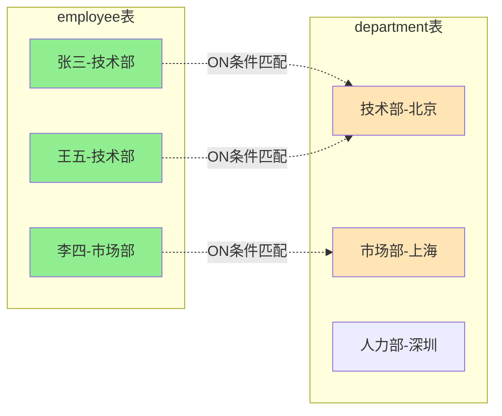

# 第3讲:增删改查实战——搞定80%日常需求

> **目标:** 掌握DML核心操作,写出高效SQL

***

## 开篇:增删改查就是你的日常

上两讲咱们把环境搭好了,会建库建表了。今天要学的是以后天天要用的东西:**增删改查(CRUD)**。

CRUD是啥?

*   C = Create(增) → INSERT
*   R = Read(查) → SELECT
*   U = Update(改) → UPDATE
*   D = Delete(删) → DELETE

这四个操作占了你日常工作的80%。掌握了它们,MySQL就算入门了。

今天这一讲,我会用大量实战案例带你练习,还会告诉你那些**踩过的坑**。保证你看完就能上手干活。

***

## 一、INSERT:往表里塞数据

### 基础用法

继续用第2讲的employee表:

```sql
-- 单条插入(最基础)
INSERT INTO employee (name, department, salary, hire_date) 
VALUES ('张三', '技术部', 8000, '2023-01-15');
```

**注意:** id字段不用填,因为它是AUTO\_INCREMENT,MySQL会自动分配。

### 批量插入(推荐,效率高10倍)

```sql
-- 批量插入(一次插入多条)
INSERT INTO employee (name, department, salary, hire_date) VALUES
('李四', '市场部', 6000, '2023-03-20'),
('王五', '技术部', 9000, '2022-11-10'),
('赵六', '人力部', 7000, '2023-05-01'),
('孙七', '技术部', 8500, '2023-02-14');
```

**为啥批量插入快?**

单条插入,MySQL要:连接→插入→提交→断开,每次都要经历这个过程。
批量插入,只需:连接→插入插入插入...→提交→断开,一次搞定。

涉及批量插入时效率差10倍以上!


### INSERT IGNORE:插入时忽略重复

假设id=1的员工已经存在,再插一次会报错:

```sql
-- 会报错:Duplicate entry '1' for key 'PRIMARY'
INSERT INTO employee (id, name, department, salary, hire_date) 
VALUES (1, '张三', '技术部', 8000, '2023-01-15');
```

用INSERT IGNORE就不会报错:

```sql
-- 不会报错,直接跳过
INSERT IGNORE INTO employee (id, name, department, salary, hire_date) 
VALUES (1, '张三', '技术部', 8000, '2023-01-15');
```

**什么时候用?**

批量导入数据时,不确定哪些已经存在了,用INSERT IGNORE可以跳过重复的,继续插入其他的。

### INSERT ... ON DUPLICATE KEY UPDATE:重复就更新

更高级的用法:如果记录存在就更新,不存在就插入。

```sql
INSERT INTO employee (id, name, department, salary, hire_date) 
VALUES (1, '张三', '技术部', 9000, '2023-01-15')
ON DUPLICATE KEY UPDATE salary = 9000;
```

这个语句的意思:

*   如果id=1不存在,就插入这条记录
*   如果id=1已存在,就把薪资更新为9000

**什么时候用?**

需要"有则更新、无则插入"的场景,比如统计数据、缓存表。

***

## 二、SELECT:查数据(重点中的重点)

SELECT是用得最多的语句,没有之一。我们从简单到复杂,一步步来。

### 基础查询

```sql
-- 查所有字段
SELECT * FROM employee;

-- 查指定字段
SELECT name, salary FROM employee;

-- 查询并起别名
SELECT name AS 姓名, salary AS 薪资 FROM employee;
```

**注意:** 生产环境别用`SELECT *`,性能差。需要啥字段就查啥字段。

### WHERE条件查询(核心)

```sql
-- 单个条件
SELECT * FROM employee WHERE department = '技术部';

-- 多个条件:AND(并且)
SELECT * FROM employee WHERE department = '技术部' AND salary > 8000;

-- 多个条件:OR(或者)
SELECT * FROM employee WHERE department = '技术部' OR department = '市场部';

-- 范围查询:BETWEEN
SELECT * FROM employee WHERE salary BETWEEN 7000 AND 9000;

-- 列表查询:IN
SELECT * FROM employee WHERE department IN ('技术部', '市场部');

-- 模糊查询:LIKE
SELECT * FROM employee WHERE name LIKE '张%';  -- 查姓张的
SELECT * FROM employee WHERE name LIKE '%三';  -- 查名字带"三"的
SELECT * FROM employee WHERE name LIKE '%小%'; -- 查名字包含"小"的

-- 空值查询
SELECT * FROM employee WHERE department IS NULL;
SELECT * FROM employee WHERE department IS NOT NULL;
```

**LIKE通配符:**

*   `%`:表示任意多个字符
*   `_`:表示单个字符

```sql
-- '张_':张三、张四,不包括张小明
SELECT * FROM employee WHERE name LIKE '张_';
```

### ORDER BY排序

```sql
-- 按薪资升序(默认)
SELECT * FROM employee ORDER BY salary;

-- 按薪资降序
SELECT * FROM employee ORDER BY salary DESC;

-- 多字段排序:先按部门,再按薪资
SELECT * FROM employee ORDER BY department, salary DESC;
```

**ASC vs DESC:**

*   ASC:升序(小到大),默认
*   DESC:降序(大到小)

### LIMIT分页查询

```sql
-- 只看前3条
SELECT * FROM employee LIMIT 3;

-- 跳过前2条,取3条(分页)
SELECT * FROM employee LIMIT 2, 3;

-- 更清晰的写法:OFFSET
SELECT * FROM employee LIMIT 3 OFFSET 2;
```

**LIMIT的两个参数:**

*   `LIMIT 2, 3`:跳过2条,取3条
*   `LIMIT 3 OFFSET 2`:意思一样,更清晰

**分页公式:**

```sql
-- 第1页:LIMIT 10 OFFSET 0
-- 第2页:LIMIT 10 OFFSET 10
-- 第3页:LIMIT 10 OFFSET 20
-- 第N页:LIMIT 10 OFFSET (N-1)*10
```

**避坑:** 数据量大时,OFFSET太大会很慢。千万级数据用`LIMIT 10 OFFSET 1000000`会卡死,后面会讲优化方案。

### DISTINCT去重

```sql
-- 查有哪些部门(去重)
SELECT DISTINCT department FROM employee;

-- 查有哪些薪资水平(去重)
SELECT DISTINCT salary FROM employee;
```

### 完整的SELECT语法顺序


**记住这个顺序:**

```sql
SELECT 字段
FROM 表名
WHERE 条件
GROUP BY 分组字段
HAVING 分组后条件
ORDER BY 排序字段
LIMIT 限制数量;
```

**注意:** 这是书写顺序,不是执行顺序。MySQL实际执行顺序是:FROM → WHERE → GROUP BY → HAVING → SELECT → ORDER BY → LIMIT

***

## 三、聚合函数:快速统计数据

聚合函数用来做统计,比如总数、平均值、最大值。

### 五大聚合函数

```sql
-- COUNT:统计数量
SELECT COUNT(*) FROM employee;                    -- 总共多少员工
SELECT COUNT(*) FROM employee WHERE department = '技术部';  -- 技术部多少人

-- SUM:求和
SELECT SUM(salary) FROM employee;                 -- 工资总和
SELECT SUM(salary) FROM employee WHERE department = '技术部';  -- 技术部工资总和

-- AVG:平均值
SELECT AVG(salary) FROM employee;                 -- 平均工资
SELECT AVG(salary) FROM employee WHERE department = '技术部';  -- 技术部平均工资

-- MAX:最大值
SELECT MAX(salary) FROM employee;                 -- 最高工资
SELECT MAX(salary) FROM employee WHERE department = '技术部';  -- 技术部最高工资

-- MIN:最小值
SELECT MIN(salary) FROM employee;                 -- 最低工资
```

**COUNT的三种写法:**

```sql
-- COUNT(*):统计行数,包括NULL
SELECT COUNT(*) FROM employee;

-- COUNT(字段):统计该字段非NULL的行数
SELECT COUNT(department) FROM employee;

-- COUNT(1):统计行数,和COUNT(*)差不多
SELECT COUNT(1) FROM employee;
```

**哪个快?**

`COUNT(*)`和`COUNT(1)`性能差不多,`COUNT(字段)`会慢一点,因为要判断字段是否为NULL。

为什么?因为`COUNT(*)`和`COUNT(1)`只需要统计行数,而`COUNT(字段)`还要读取字段值并判断是否为NULL。具体优化原理会在第5讲《索引》中详细讲解。

一般用`COUNT(*)`就行。

### GROUP BY分组统计

这是重点!很多复杂统计都要用到分组。

```sql
-- 统计各部门人数
SELECT department, COUNT(*) AS 人数
FROM employee
GROUP BY department;

-- 统计各部门平均工资
SELECT department, AVG(salary) AS 平均工资
FROM employee
GROUP BY department;

-- 统计各部门最高工资
SELECT department, MAX(salary) AS 最高工资
FROM employee
GROUP BY department;
```

### HAVING:分组后筛选

WHERE是分组前筛选,HAVING是分组后筛选。

```sql
-- 统计人数超过2的部门
SELECT department, COUNT(*) AS 人数
FROM employee
GROUP BY department
HAVING COUNT(*) > 2;

-- 统计平均工资超过8000的部门
SELECT department, AVG(salary) AS 平均工资
FROM employee
GROUP BY department
HAVING AVG(salary) > 8000;
```

**WHERE vs HAVING:**

| 对比项      | WHERE                 | HAVING                      |
| -------- | --------------------- | --------------------------- |
| 作用时机     | 分组前筛选                 | 分组后筛选                       |
| 能否使用聚合函数 | 不能                    | 能                           |
| 例子       | `WHERE salary > 8000` | `HAVING AVG(salary) > 8000` |

记住:**WHERE筛选行,HAVING筛选组**。

***

## 四、多表查询:JOIN的基础用法

实际工作中,数据经常分散在多个表里,需要关联查询。

### 准备两张表

我们再建一个部门表:

```sql
CREATE TABLE department (
    id INT AUTO_INCREMENT PRIMARY KEY,
    dept_name VARCHAR(30) NOT NULL,
    location VARCHAR(50)
) DEFAULT CHARSET=utf8mb4;

INSERT INTO department (dept_name, location) VALUES
('技术部', '北京'),
('市场部', '上海'),
('人力部', '深圳');
```

现在有两张表:

*   employee:员工表(name, department, salary)
*   department:部门表(dept\_name, location)

### INNER JOIN:内连接(最常用)

查询员工和所在部门的城市:

```sql
SELECT e.name, e.salary, d.location
FROM employee e
INNER JOIN department d ON e.department = d.dept_name;
```

**执行结果:**

    +--------+----------+----------+
    | name   | salary   | location |
    +--------+----------+----------+
    | 张三   | 8000.00  | 北京     |
    | 李四   | 6000.00  | 上海     |
    | 王五   | 9000.00  | 北京     |
    | 赵六   | 7000.00  | 深圳     |
    | 孙七   | 8500.00  | 北京     |
    +--------+----------+----------+

**语法解释:**

*   `FROM employee e`:给表起别名e(方便后面引用)
*   `INNER JOIN department d`:关联部门表,起别名d
*   `ON e.department = d.dept_name`:关联条件(员工的部门 = 部门的名称)

### JOIN的可视化理解



INNER JOIN只返回两表都匹配上的记录。如果员工的部门在department表中不存在,这条记录就不会出现在结果中。

**其他JOIN简单介绍:**

*   LEFT JOIN:左表全部保留,右表没匹配的显示NULL
*   RIGHT JOIN:右表全部保留,左表没匹配的显示NULL
*   FULL JOIN:两表都保留(MySQL不支持,要用UNION模拟)

这些后面的课会详细讲,今天先掌握INNER JOIN就够了。

***

## 五、UPDATE:修改数据(危险操作)

UPDATE用来修改表中的数据,**一定要加WHERE条件**,否则会改全表!

### 正确的UPDATE

```sql
-- 给张三涨薪到9000
UPDATE employee SET salary = 9000 WHERE name = '张三';

-- 给技术部所有人涨薪10%
UPDATE employee SET salary = salary * 1.1 WHERE department = '技术部';

-- 同时修改多个字段
UPDATE employee 
SET salary = 10000, department = '架构部' 
WHERE name = '王五';
```

### 不加WHERE的后果

```sql
-- ❌ 危险!会把所有人工资都改成5000
UPDATE employee SET salary = 5000;
```

**假设场景:**

如果有人想给id=1的员工改工资,但忘了加WHERE:

```sql
UPDATE employee SET salary = 5000;  -- 忘了加WHERE
```

结果会是:全公司所有人工资都变成5000。如果没有备份,只能从binlog日志里一条条恢复,非常麻烦。

**避坑技巧:**

1.  **先SELECT,再UPDATE**
    ```sql
    -- 先查出来,确认是要改的数据
    SELECT * FROM employee WHERE name = '张三';

    -- 确认无误后,把SELECT改成UPDATE
    UPDATE employee SET salary = 9000 WHERE name = '张三';
    ```

2.  **加LIMIT限制**
    ```sql
    -- 最多只改1条,就算WHERE写错了也不会改太多
    UPDATE employee SET salary = 9000 WHERE name = '张三' LIMIT 1;
    ```

3.  **开事务测试**
    ```sql
    START TRANSACTION;  -- 开启事务
    UPDATE employee SET salary = 9000 WHERE name = '张三';
    SELECT * FROM employee;  -- 检查结果
    ROLLBACK;  -- 回滚,不生效
    -- 确认没问题后,再COMMIT提交
    ```

***

## 六、DELETE:删除数据(更危险的操作)

DELETE用来删除表中的数据,**一定要加WHERE条件**,否则会删全表!

### 正确的DELETE

```sql
-- 删除id=5的员工
DELETE FROM employee WHERE id = 5;

-- 删除薪资低于6000的员工
DELETE FROM employee WHERE salary < 6000;

-- 删除技术部的员工
DELETE FROM employee WHERE department = '技术部';
```

### 不加WHERE的后果

```sql
-- ❌ 超级危险!会删除所有数据
DELETE FROM employee;
```

**假设场景:**

如果有人本想在测试库删除数据,但不小心连到了生产库:

```sql
DELETE FROM users;  -- 本来想在测试库执行,结果连的是生产库
```

后果:所有用户数据全部删除。即使有备份,也会丢失最近一段时间的数据,造成严重损失。

**避坑技巧:**

1.  **先SELECT,再DELETE**
    ```sql
    -- 先查出来,确认是要删的数据
    SELECT * FROM employee WHERE salary < 6000;

    -- 确认无误后,把SELECT改成DELETE
    DELETE FROM employee WHERE salary < 6000;
    ```

2.  **加LIMIT限制**
    ```sql
    -- 最多只删1条
    DELETE FROM employee WHERE id = 5 LIMIT 1;
    ```

3.  **用软删除代替硬删除**

    给表加个`is_deleted`字段,删除时只是标记,不是真删:

    ```sql
    -- 建表时加字段
    ALTER TABLE employee ADD COLUMN is_deleted TINYINT DEFAULT 0;

    -- "删除"时只是改标记
    UPDATE employee SET is_deleted = 1 WHERE id = 5;

    -- 查询时过滤掉已删除的
    SELECT * FROM employee WHERE is_deleted = 0;
    ```

### DELETE vs TRUNCATE vs DROP

三种删除数据的方式,区别很大:

| 对比项     | DELETE  | TRUNCATE | DROP  |
| ------- | ------- | -------- | ----- |
| 作用      | 删除数据    | 清空表数据    | 删除整个表 |
| 能加WHERE | 能       | 不能       | 不能    |
| 能回滚     | 能(在事务中) | 不能       | 不能    |
| 速度      | 慢(逐行删)  | 快(直接清空)  | 最快    |
| 自增ID    | 不重置     | 重置为1     | 表都没了  |

```sql
-- DELETE:删除id=5的数据,可以回滚
DELETE FROM employee WHERE id = 5;

-- TRUNCATE:清空表,不能回滚,自增ID重置
TRUNCATE TABLE employee;

-- DROP:删除整个表,连结构都没了
DROP TABLE employee;
```

**建议:**

*   删除部分数据用DELETE
*   清空整个表用TRUNCATE(快)
*   删除表结构用DROP(慎用)

***

## 七、常用函数速查

### 字符串函数

| 函数          | 作用    | 示例                                     |
| ----------- | ----- | -------------------------------------- |
| CONCAT      | 拼接字符串 | `SELECT CONCAT(name, '-', department)` |
| LENGTH      | 字符串长度 | `SELECT LENGTH(name)`                  |
| SUBSTRING   | 截取字符串 | `SELECT SUBSTRING(name, 1, 1)` 截取姓氏    |
| REPLACE     | 替换字符串 | `SELECT REPLACE(department, '部', '组')` |
| UPPER/LOWER | 大小写转换 | `SELECT UPPER('hello')` → HELLO        |

### 数字函数

| 函数    | 作用   | 示例                              |
| ----- | ---- | ------------------------------- |
| ROUND | 四舍五入 | `SELECT ROUND(8.567, 2)` → 8.57 |
| CEIL  | 向上取整 | `SELECT CEIL(8.1)` → 9          |
| FLOOR | 向下取整 | `SELECT FLOOR(8.9)` → 8         |

### 日期函数(最常用)

| 函数           | 作用     | 示例                                        |
| ------------ | ------ | ----------------------------------------- |
| NOW          | 当前时间   | `SELECT NOW()` → 2024-01-15 10:30:00      |
| CURDATE      | 当前日期   | `SELECT CURDATE()` → 2024-01-15           |
| DATE\_FORMAT | 格式化日期  | `SELECT DATE_FORMAT(hire_date, '%Y年%m月')` |
| DATEDIFF     | 日期差(天) | `SELECT DATEDIFF(NOW(), hire_date)`       |
| DATE\_ADD    | 日期加减   | `SELECT DATE_ADD(NOW(), INTERVAL 7 DAY)`  |

**实用案例:查询入职超过1年的员工**

```sql
SELECT name, hire_date, DATEDIFF(NOW(), hire_date) AS 入职天数
FROM employee
WHERE DATEDIFF(NOW(), hire_date) > 365;
```

***

## 八、综合实战案例

### 案例1:查询技术部薪资>8000且入职超过1年的员工

```sql
SELECT name, salary, hire_date, DATEDIFF(NOW(), hire_date) AS 入职天数
FROM employee
WHERE department = '技术部'
  AND salary > 8000
  AND DATEDIFF(NOW(), hire_date) > 365
ORDER BY salary DESC;
```

### 案例2:统计各部门平均工资>7500的部门

```sql
SELECT department, 
       COUNT(*) AS 人数,
       AVG(salary) AS 平均工资
FROM employee
GROUP BY department
HAVING AVG(salary) > 7500
ORDER BY 平均工资 DESC;
```

### 案例3:查询每个部门工资最高的员工(子查询)

```sql
SELECT e.name, e.department, e.salary
FROM employee e
WHERE e.salary = (
    SELECT MAX(salary) 
    FROM employee 
    WHERE department = e.department
);
```

***

## 九、性能优化要点

### 1. 避免SELECT \*

`SELECT *`会查出所有字段,浪费网络传输。需要啥查啥。

```sql
-- ✅ 好
SELECT name, salary FROM employee;
```

### 2. 用LIMIT限制结果

```sql
-- ✅ 好:只要前10条
SELECT * FROM employee WHERE department = '技术部' LIMIT 10;
```

### 3. WHERE中避免使用函数

```sql
-- ❌ 差:索引失效,全表扫描
SELECT * FROM employee WHERE YEAR(hire_date) = 2023;

-- ✅ 好:能用上索引
SELECT * FROM employee WHERE hire_date >= '2023-01-01' AND hire_date < '2024-01-01';
```

WHERE中对字段使用函数会导致索引失效。具体原理第5讲《索引》详细讲解。

***

## 十、今天学了啥?快速回顾

### INSERT插入

```sql
-- 单条插入
INSERT INTO employee (name, salary) VALUES ('张三', 8000);

-- 批量插入(推荐)
INSERT INTO employee (name, salary) VALUES ('张三', 8000), ('李四', 9000);

-- 忽略重复
INSERT IGNORE INTO employee ...

-- 重复就更新
INSERT INTO employee ... ON DUPLICATE KEY UPDATE salary = 9000;
```

### SELECT查询(重点)

```sql
-- 条件查询
SELECT * FROM employee WHERE department = '技术部' AND salary > 8000;

-- 排序
SELECT * FROM employee ORDER BY salary DESC;

-- 分页
SELECT * FROM employee LIMIT 10 OFFSET 20;

-- 聚合统计
SELECT department, COUNT(*), AVG(salary) 
FROM employee 
GROUP BY department 
HAVING AVG(salary) > 8000;

-- 关联查询
SELECT e.name, d.location
FROM employee e
INNER JOIN department d ON e.department = d.dept_name;
```

### UPDATE/DELETE(危险,必加WHERE)

```sql
-- 先SELECT确认,再UPDATE
UPDATE employee SET salary = 9000 WHERE name = '张三' LIMIT 1;

-- 先SELECT确认,再DELETE
DELETE FROM employee WHERE id = 5 LIMIT 1;
```

### 常用函数

*   字符串:CONCAT、LENGTH、SUBSTRING、REPLACE
*   数字:ROUND、CEIL、FLOOR
*   日期:NOW、DATEDIFF、DATE\_FORMAT、DATE\_ADD

***

## 十一、作业:基于员工表的10个查询

今天的作业是基于employee和department表,完成以下查询:

**基础查询(1-3):**

1.  查询所有员工的姓名和薪资
2.  查询技术部的所有员工
3.  查询薪资在7000-9000之间的员工

**条件查询(4-6):**
4\. 查询薪资>8000的员工,按薪资降序排列

5.  查询姓"张"或"李"的员工
6.  查询入职日期在2023年的员工

**聚合统计(7-8):**
7\. 统计各部门的人数和平均薪资

8.  查询薪资最高的前3名员工

**复杂查询(9-10):**
9\. 查询各部门薪资最高的员工(用子查询)

10. 查询员工和所在部门的城市(用JOIN)

**提示:**

```sql
-- 第6题:查2023年的员工
WHERE hire_date >= '2023-01-01' AND hire_date < '2024-01-01'

-- 第9题:子查询
WHERE salary = (SELECT MAX(salary) FROM employee WHERE department = e.department)

-- 第10题:关联查询
FROM employee e INNER JOIN department d ON e.department = d.dept_name
```

把你的SQL写出来练习,加深理解!

***

## 十二、下一讲预告

今天咱们把增删改查都搞定了。但还有个棘手的问题等着你。

**思考一个场景:**
老板让你查: **"每个部门薪资最高的前3名员工"**。

用今天学的知识，你可能会想到:

1.  先查技术部前3名
2.  再查市场部前3名
3.  ...如果有一百个部门，你要查一百次吗？

或者写一个超级复杂的嵌套子查询，写到自己都晕了。

这就是**第4讲:现代SQL高级特性——窗口函数与CTE** 要解决的问题。

MySQL 8.0+引入了神器:

*   **窗口函数(Window Functions):** 解决排名、累计、同环比等复杂统计，一行代码搞定"每部门前3名"。
*   **CTE(公共表表达式):** 把几十行的复杂SQL拆解成积木，清晰易读。

这些特性是中高级开发的必杀技，学会了它们，你的SQL水平将直接上一个台阶！

**准备工作:**

*   确保今天的JOIN和GROUP BY作业已完成
*   试着想一下，如果不学新特性，怎么查"每部门前3名"？(体验一下痛苦，下一讲会更爽)

***

**下一讲见!咱们一起解锁SQL的"魔法"技能!**
