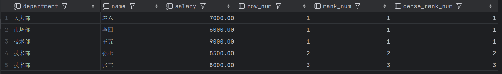
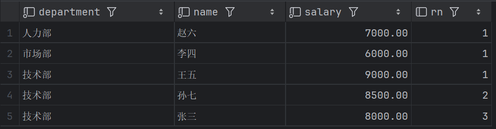
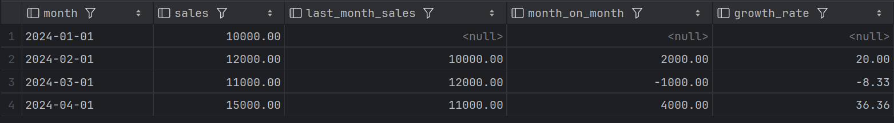
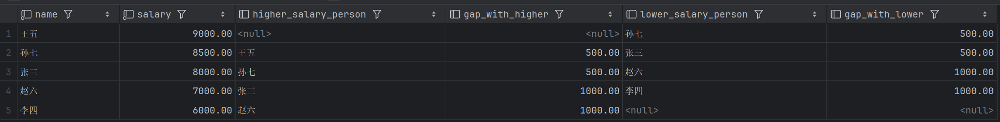
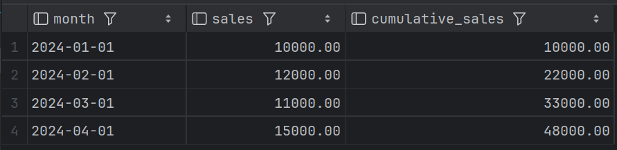
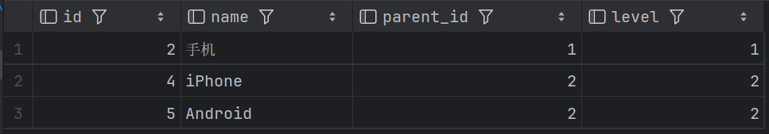

# 第4讲：现代SQL高级特性——窗口函数与CTE

> **目标**: 掌握MySQL 8.0+的核心特性：窗口函数和CTE，这是面试高频考点，也是解决复杂查询的利器。
---

## 一、为什么需要窗口函数？

### 传统方案的痛点

**需求：** 查询每个部门薪资前3名的员工

**传统方案（关联子查询）：**
```sql
SELECT e1.*
FROM employee e1
WHERE (
          SELECT COUNT(*)
          FROM employee e2
          WHERE e2.department = e1.department
            AND e2.salary >= e1.salary
      ) <= 3
ORDER BY department, salary DESC;
```

**问题：**
-   性能差：这种方法每次查询 `e1` 时，都要针对 `e2` 进行子查询，这导致了复杂度为 O(N²)，效率较低，尤其是在数据量大时。
-   不灵活：如果业务需求发生变化，需要重写整个查询。
-   SQL 复杂且不容易理解。

这个方案在一些较小的数据集上能正常工作，但在数据量增大时会变得非常慢，因为每个 `e1` 的查询都需要扫描整个表，这样会产生大量的重复计算。

---

### 窗口函数方案

```sql
WITH ranked_employees AS (
    SELECT 
        *,
        ROW_NUMBER() OVER (PARTITION BY department ORDER BY salary DESC) AS rn
    FROM employee
)
SELECT * FROM ranked_employees WHERE rn <= 3;
```

**优势：**

-   **可读性**：将复杂的查询分解为多个部分，使查询更加易于理解。
-   **复用性**：如果查询中有多次使用某个中间结果集，可以将其提取到 CTE 中进行复用。
---

## 二、窗口函数核心语法

### 语法结构

```sql
<窗口函数> OVER (
    PARTITION BY <分组字段>  -- 类似GROUP BY，但不聚合行
    ORDER BY <排序字段>      -- 组内排序
    ROWS/RANGE <窗口范围>    -- 可选，指定计算范围
)
```

**关键理解：**
- `PARTITION BY`：分组，但不会减少行数
- `ORDER BY`：组内排序
- 窗口函数不能直接在WHERE中使用，需要子查询包裹

---

## 三、排名函数（ROW_NUMBER/RANK/DENSE_RANK）

### 三大排名函数对比

| 函数 | 并列处理 | 示例 | 适用场景 |
|------|---------|------|---------|
| **ROW_NUMBER()** | 连续行号 | 1,2,3,4 | 分页、TopN |
| **RANK()** | 并列跳号 | 1,2,2,4 | 成绩排名(允许并列) |
| **DENSE_RANK()** | 并列不跳号 | 1,2,2,3 | 密集排名 |

### 实战案例

**场景1：每个部门薪资排名**
```sql
SELECT 
    department,
    name,
    salary,
    ROW_NUMBER() OVER (PARTITION BY department ORDER BY salary DESC) AS row_num,
    RANK() OVER (PARTITION BY department ORDER BY salary DESC) AS rank_num,
    DENSE_RANK() OVER (PARTITION BY department ORDER BY salary DESC) AS dense_rank_num
FROM employee;
```

**结果对比：**



**解释**：

-   `ROW_NUMBER()` 为每个部门的员工分配一个唯一的排名，没有并列。每个部门的排名是连续的，且不会有相同的排名。例如，在 **技术部**，`孙七` 排名第 2，而不是和 `王五` 共享第 2 排名。

-   `RANK()` 会给相同薪资的员工分配相同的排名，并且跳过后续排名。例如，在 **技术部**，`孙七` 和 `王五` 的薪资相同，因此两者的排名为 1，接下来是排名为 3 的员工。

-   `DENSE_RANK()` 也会为相同薪资的员工分配相同的排名，但不同的是，它不会跳过后续排名。例如，`孙七` 和 `王五` 的薪资相同，他们共享排名第 1，但下一名员工的排名是 2，而不是 3。
---

**场景2：每个部门薪资前3名**
```sql
SELECT * FROM (
    SELECT 
        department, name, salary,
        ROW_NUMBER() OVER (PARTITION BY department ORDER BY salary DESC) AS rn
    FROM employee
) t WHERE rn <= 3;
```



---

## 四、偏移函数（LAG/LEAD）
### 环比、同比和趋势分析简介

-   **环比（Month-on-Month，MoM）** ：环比指的是当前时间段与前一个时间段数据的比较，通常用于衡量某个指标在一个周期（如一个月）内的增长或下降。例如，比较本月与上月的销售额，评估业务的短期增长或变化趋势。
-   **同比（Year-on-Year，YoY）** ：同比指的是当前时间段与去年同一时间段的数据对比。通常用于评估一年时间内业务的变化，帮助我们看到长期的增长或下降趋势。比如对比今年 1 月与去年 1 月的销售额，判断是否有增长。
-   **趋势分析（Trend Analysis）** ：趋势分析旨在识别和分析一段时间内数据的变化方向。通过对比前后数据，可以帮助我们了解某个指标的长期走势，常用于预测未来的变化。例如，查看过去几个月的销售数据，分析是否有持续增长的趋势。
-   **预测（Forecasting）** ：预测是通过分析当前数据的趋势，推测未来数据的可能值。使用 `LEAD` 函数可以帮助你在现有数据的基础上，预测未来的变化趋势，比如预测未来几个月的销售额。

### 语法与作用

| 函数 | 作用 | 应用场景 |
|------|------|---------|
| **LAG(字段, N)** | 访问前N行数据 | 计算环比、同比 |
| **LEAD(字段, N)** | 访问后N行数据 | 预测、趋势分析 |

### 实战案例

**场景：计算每月销售额的环比增长**
```sql
-- 假设有月度销售表
CREATE TABLE monthly_sales (
    month DATE,
    sales DECIMAL(10,2)
);

INSERT INTO monthly_sales VALUES
('2024-01-01', 10000),
('2024-02-01', 12000),
('2024-03-01', 11000),
('2024-04-01', 15000);

-- 计算环比增长
SELECT 
    month,
    sales,
    LAG(sales, 1) OVER (ORDER BY month) AS last_month_sales,
    sales - LAG(sales, 1) OVER (ORDER BY month) AS month_on_month,
    -- 使用 NULLIF 防止除以 0
    ROUND((sales - LAG(sales, 1) OVER (ORDER BY month)) / NULLIF(LAG(sales, 1) OVER (ORDER BY month), 0) * 100, 2) AS growth_rate
FROM monthly_sales;
```

**结果：**


**解释：**
-   `month`：表示月份。
-   `sales`：表示该月份的销售额。
-   `last_month_sales`：使用 `LAG` 函数获取上个月的销售额。在 2024 年 1 月的行中，由于没有前一个月的记录，这个字段为 `NULL`。
-   `month_on_month`：计算环比增长，即当前月销售额与上月销售额的差值。2024 年 1 月无前一个月数据，差值为 `NULL`。
-   `growth_rate`：计算环比增长率，通过 `(sales - last_month_sales) / last_month_sales * 100` 得到的百分比值。2024 年 1 月由于没有前一个月数据，无法计算增长率。
---

**场景：查看员工与前一名、后一名的薪资差距**
```sql
SELECT 
    name,
    salary,
    LAG(name, 1) OVER (ORDER BY salary DESC) AS higher_salary_person,
    LAG(salary, 1) OVER (ORDER BY salary DESC) - salary AS gap_with_higher,
    LEAD(name, 1) OVER (ORDER BY salary DESC) AS lower_salary_person,
    salary - LEAD(salary, 1) OVER (ORDER BY salary DESC) AS gap_with_lower
FROM employee;
```



### 解释：

-   `higher_salary_person`：通过 `LAG` 函数查找当前员工薪资前一位的员工（即薪资较高的员工）。

-   `gap_with_higher`：当前员工与前一位员工的薪资差距。即通过 `LAG` 函数找到前一位员工后，计算两者的薪资差。

-   `ower_salary_person`：通过 `LEAD` 函数查找当前员工薪资后一位的员工（即薪资较低的员工）。

-   `gap_with_lower`：当前员工与后一位员工的薪资差距。即通过 `LEAD` 函数找到后一位员工后，计算两者的薪资差。

---

## 五、聚合窗口函数（SUM/AVG OVER）

### 累计求和

**场景：计算累计销售额**
```sql
SELECT 
    month,
    sales,
    SUM(sales) OVER (ORDER BY month) AS cumulative_sales
FROM monthly_sales;
```

**结果：**



---

### 移动平均

**场景：计算最近3个月的移动平均销售额**
```sql
SELECT 
    month,
    sales,
    AVG(sales) OVER (
        ORDER BY month 
        ROWS BETWEEN 2 PRECEDING AND CURRENT ROW
    ) AS moving_avg_3months
FROM monthly_sales;
```


**解释：**
- `moving_avg_3months` 表示当前月份及其前两个月的平均销售额

**窗口范围说明：**
- `ROWS BETWEEN 2 PRECEDING AND CURRENT ROW`：当前行及前2行（共3行）
- `ROWS BETWEEN UNBOUNDED PRECEDING AND CURRENT ROW`：从第一行到当前行（累计）

> **进阶提示：ROWS vs RANGE**
> *   **ROWS**：按**物理行**偏移（如“前一行”）。
> *   **RANGE**：按**数值**偏移（如“日期减1天”或“金额减100”），处理重复值时行为不同。

---

## 六、CTE公共表表达式（WITH子句）

### CTE 的入门介绍

在正式进入 SQL 示例前，确实需要对 CTE（公共表表达式） 做一个基础的介绍。CTE 是一种临时的结果集，可以在 SELECT、INSERT、UPDATE 或 DELETE 语句中使用。它帮助我们分解复杂的查询，使其更易读和可维护。

基本语法：
```sql
WITH cte_name AS (
-- CTE 查询内容
SELECT ...
)
SELECT * FROM cte_name;
```

### 为什么需要CTE？

**传统子查询：嵌套复杂**
```sql
SELECT dept_name, avg_salary
FROM departments d
JOIN (
    SELECT dept_id, AVG(salary) AS avg_salary
    FROM employees
    GROUP BY dept_id
) e ON d.id = e.dept_id
WHERE e.avg_salary > (
    SELECT AVG(salary) FROM employees
);
```

**CTE写法：逻辑清晰**
```sql
WITH dept_avg AS (
    SELECT dept_id, AVG(salary) AS avg_salary
    FROM employees
    GROUP BY dept_id
),
company_avg AS (
    SELECT AVG(salary) AS avg_salary FROM employees
)
SELECT d.dept_name, da.avg_salary
FROM departments d
JOIN dept_avg da ON d.id = da.dept_id
CROSS JOIN company_avg ca
WHERE da.avg_salary > ca.avg_salary;
```

**CTE的优势：**
- ✅ 命名清晰，可读性高
- ✅ 可以多次引用同一个CTE
- ✅ 逻辑分层，便于调试

---

## 七、递归CTE（查询层级数据）

### 语法结构

```sql
WITH RECURSIVE cte_name AS (
    -- 1. 锚点查询（初始数据）
    SELECT ... FROM table WHERE ...
    
    UNION ALL
    
    -- 2. 递归查询（关联上一层结果）
    SELECT ... FROM table JOIN cte_name ON ...
)
SELECT * FROM cte_name;
```

### 实战案例

**场景：商品分类树**
```sql
-- 商品分类表
CREATE TABLE categories (
    id INT PRIMARY KEY,
    name VARCHAR(50),
    parent_id INT
);

INSERT INTO categories VALUES
(1, '电子产品', NULL),
(2, '手机', 1),
(3, '电脑', 1),
(4, 'iPhone', 2),
(5, 'Android', 2),
(6, '笔记本', 3),
(7, '台式机', 3);

-- 查询"手机"分类下的所有子分类
WITH RECURSIVE category_tree AS (
    SELECT id, name, parent_id, 1 AS level
    FROM categories
    WHERE id = 2
    
    UNION ALL
    
    SELECT c.id, c.name, c.parent_id, ct.level + 1
    FROM categories c
    JOIN category_tree ct ON c.parent_id = ct.id
)
SELECT * FROM category_tree;
```



### 递归 CTE 语法解析：

#### 1. **初始化查询（锚点查询）**

```sql
SELECT id, name, parent_id, 1 AS level
FROM categories
WHERE id = 2  -- 初始查询，找到"手机"类别
```

* 这是递归查询的 **锚点查询**，它获取了 **“手机”** 类别（ID 为 2）的数据，并且设置了一个初始的 **`level`** 值为 1，表示“手机”分类的层级是第一层。
* `level` 字段用于标记分类的层级，以便在递归过程中可以区分不同层级的分类。

#### 2. **递归查询（递归部分）**

```sql
UNION ALL
SELECT c.id, c.name, c.parent_id, ct.level + 1
FROM categories c
JOIN category_tree ct ON c.parent_id = ct.id
```

* **`UNION ALL`**：将锚点查询和递归查询的结果合并。这里使用 **`UNION ALL`** 而不是 **`UNION`**，因为我们不需要去重，只是简单地将每次递归的结果进行累积。

* **递归部分**：每次递归查询都会查找当前 `category_tree`（上一次递归结果）中的 **`id`**，并根据这些 **`id`** 找到它们的子分类（即通过 **`parent_id = ct.id`** 的条件来进行连接）。

* `ct.level + 1`：每次递归时，我们将当前分类的层级 `level` 加 1，以表示子分类比父分类多一层。

#### 3. **最终查询结果**

```sql
SELECT * FROM category_tree;
```

### 递归 CTE 的优势：

1. **适用于树形结构数据**：递归 CTE 很适合查询和处理层级结构数据（如分类树、组织架构等）。
2. **结构清晰**：通过 `WITH RECURSIVE` 定义递归查询，能够清晰地分隔锚点查询和递归查询部分，使得查询逻辑更加易懂。
3. **可扩展性强**：如果层级结构很深，递归查询会继续执行直到所有子分类被查询完毕，无需手动指定层级的深度。

---

## 八、避坑指南

### 坑1：窗口函数不能直接在WHERE中使用

```sql
-- ❌ 错误
SELECT *, ROW_NUMBER() OVER (PARTITION BY department ORDER BY salary DESC) AS rn
FROM employee
WHERE rn <= 3;  -- 报错！

-- ✅ 正确
SELECT * FROM (
                  SELECT *, ROW_NUMBER() OVER (PARTITION BY department ORDER BY salary DESC) AS rn
                  FROM employee
              ) t WHERE rn <= 3;
```

---

### 坑2：递归CTE必须有终止条件

```sql
-- ❌ 错误：死循环
WITH RECURSIVE bad_cte AS (
    SELECT 1 AS n
    UNION ALL
    SELECT n + 1 FROM bad_cte  -- 永远不会停止
)
SELECT * FROM bad_cte;

-- ✅ 正确：加终止条件
WITH RECURSIVE good_cte AS (
    SELECT 1 AS n
    UNION ALL
    SELECT n + 1 FROM good_cte WHERE n < 10  -- 终止条件
)
SELECT * FROM good_cte;
```

---

### 坑3：PARTITION BY不同于GROUP BY

```sql
-- GROUP BY：聚合行，减少行数
SELECT department, COUNT(*) FROM employee GROUP BY department;
-- 结果：3行（3个部门）

-- PARTITION BY：分组计算，不减少行数
SELECT *, COUNT(*) OVER (PARTITION BY department) FROM employee;
-- 结果：10行（所有员工，每行显示所在部门的总人数）
```

---

## 九、本讲作业

### 基础练习
1. 查询每个部门薪资排名前3的员工（用ROW_NUMBER）
2. 计算每个员工的薪资与部门平均薪资的差距（用AVG OVER）
3. 查询每个员工的上一名和下一名（用LAG/LEAD）
4. 查询每个部门薪资最高和最低的员工（尝试使用 FIRST_VALUE / LAST_VALUE）

### 进阶挑战
4. 用CTE改写一个复杂的嵌套子查询（从你的项目中找）
5. 用递归CTE查询某员工的所有下属（包括下属的下属）
6. 用窗口函数实现分页（替代LIMIT OFFSET）

### 性能对比
7. 对比"每部门TOP3"的两种实现（窗口函数 vs 关联子查询），测试性能差异

---

## 十、下一讲预告

今天学习了现代SQL的强大特性，下一讲回到MySQL的核心原理。

**第5讲：事务——数据一致性的保护伞**

- 什么是事务？ACID特性是啥？
- 转账的钱怎么保证不丢不重？
- 两个人同时改同一条数据会怎样？
- **隔离级别**：脏读、不可重复读、幻读
- undo log和redo log的作用

掌握了窗口函数和CTE，你的SQL查询能力已经超越了80%的开发者。下一讲我们深入MySQL内核，理解事务和并发控制的原理！

**准备工作：**
- 完成今天的作业，熟练掌握窗口函数
- 思考：两个人同时给同一个账户转账1000元，最后余额应该是多少？

---

**下一讲见！**


