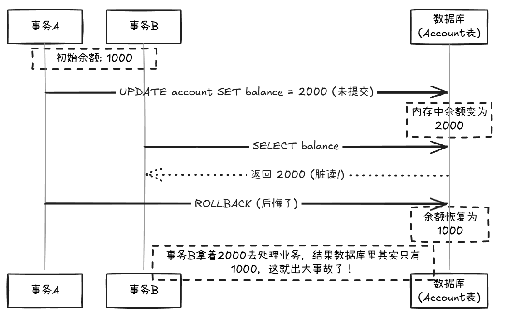
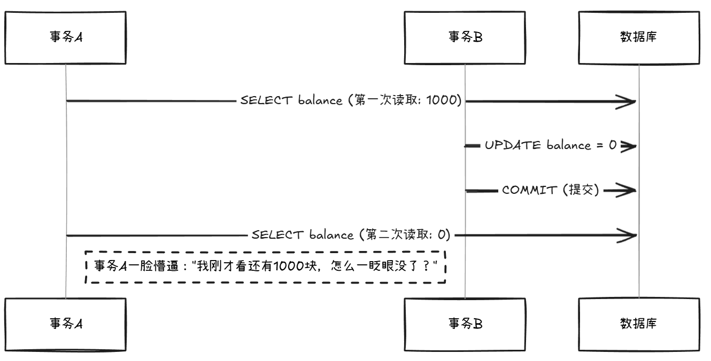
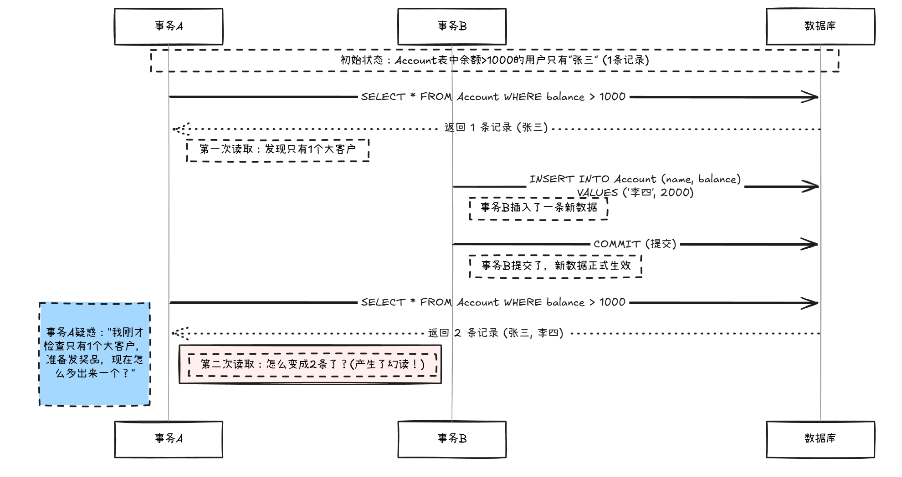
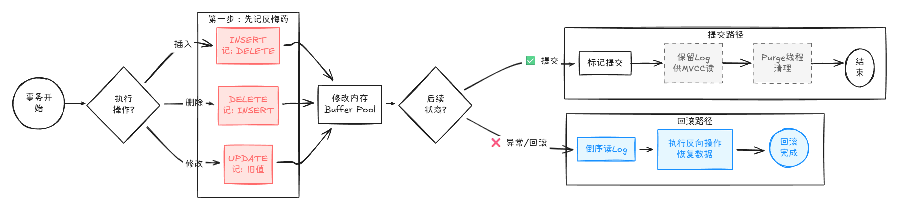
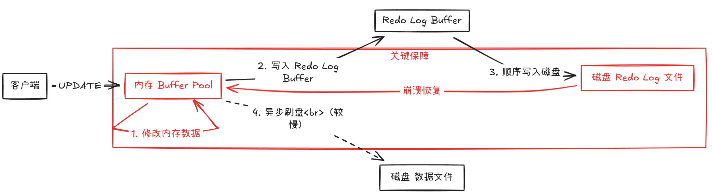

# 第5讲:事务——数据一致性的保护伞

> **目标:** 理解ACID特性,掌握隔离级别,解决并发问题

---

## 开篇:一个转账引发的血案

**需求：** 模拟一个简单的转账场景。为了演示，我们需要先准备一张账户表。

```sql
-- 准备工作：创建账户表并初始化数据
CREATE TABLE account (
    id INT PRIMARY KEY AUTO_INCREMENT COMMENT '主键',
    user_id INT NOT NULL COMMENT '用户ID',
    balance DECIMAL(10, 2) NOT NULL DEFAULT 0.00 COMMENT '余额'
) COMMENT '账户表';

-- 初始化两个用户：用户1有1000元，用户2有0元
INSERT INTO account (user_id, balance) VALUES (1, 1000.00), (2, 0.00);
```

想象一个场景:你给朋友转账1000元。

```sql
-- 第1步:从你的账户扣1000
UPDATE account SET balance = balance - 1000 WHERE user_id = 1;

-- 第2步:给朋友账户加1000
UPDATE account SET balance = balance + 1000 WHERE user_id = 2;
```

如果第1步执行成功,你的钱扣了。但第2步突然断电了,朋友没收到钱。

这1000元凭空消失了!

这就是没有事务保护的后果。今天咱们就来搞懂:什么是事务?怎么用事务保证数据不出错?

---

## 一、事务是什么?

**一句话定义:** 事务是一组SQL操作,要么全部成功,要么全部失败,不存在"做一半"的情况。

### 事务的基本语法

```sql
-- 开启事务
START TRANSACTION;
-- 或者用 BEGIN;

-- 执行SQL操作
UPDATE account SET balance = balance - 1000 WHERE user_id = 1;
UPDATE account SET balance = balance + 1000 WHERE user_id = 2;

-- 提交事务(确认修改)
COMMIT;

-- 或者回滚事务(撤销修改)
ROLLBACK;
```

### 转账场景正确写法

```sql
START TRANSACTION;

-- 扣款
UPDATE account SET balance = balance - 1000 WHERE user_id = 1;

-- 加款
UPDATE account SET balance = balance + 1000 WHERE user_id = 2;

-- 检查余额是否正确
SELECT SUM(balance) FROM account WHERE user_id IN (1, 2);

-- 确认无误,提交
COMMIT;
-- 如果有问题,执行 ROLLBACK;
```


---

## 二、ACID特性:事务的四大保障

ACID是事务的四大特性,缺一不可。用转账场景来理解:

### A - 原子性(Atomicity)

**含义:** 事务是最小执行单位,要么全成功,要么全失败。

**转账场景:** 扣款和加款必须同时成功。如果加款失败,扣款也要撤销。

**怎么实现的?** 靠**undo log(回滚日志)**。MySQL会记录修改前的数据,出错时根据日志回滚。

```sql
START TRANSACTION;
UPDATE account SET balance = balance - 1000 WHERE user_id = 1;  -- 成功
UPDATE account SET balance = balance + 1000 WHERE user_id = 999; -- 失败(用户不存在)
ROLLBACK; -- 第1步的扣款会被撤销
```

### C - 一致性(Consistency)

**含义:** 事务执行前后,数据的完整性约束不能被破坏。

**转账场景:** 转账前后,两个账户的总金额必须不变。

**举例:**
- 转账前:A有5000,B有3000,总额8000
- 转账后:A有4000,B有4000,总额还是8000

**怎么实现的?** 一致性是最终目标，它是由 A (原子性)、I (隔离性)、D (持久性) 共同保证的，再加上应用层的逻辑判断（比如转账金额不能为负数）。

如果总额变了,说明数据不一致了,事务必须回滚。

### I - 隔离性(Isolation)

**含义:** 多个事务并发执行时,互不干扰。

**转账场景:** 你给A转账的同时,别人也在给A转账,两个事务不能互相影响。

**怎么实现的?** 靠**锁 (Locks)** 和 **MVCC (多版本并发控制)**。
> *   **锁**：像红绿灯，阻止冲突的修改。
> *   **MVCC**：像平行宇宙，让读写互不干扰。
> *   *(这两个概念非常重要，我们会在第7讲专门深入讲解)*

**问题:** 这是最复杂的特性,后面会详细讲"隔离级别"。

### D - 持久性(Durability)

**含义:** 事务一旦提交,数据永久保存,即使系统崩溃也不会丢。

**转账场景:** 提交后显示"转账成功",这时就算断电,钱也不会丢。

**怎么实现的?** 靠**redo log(重做日志)**。提交时先写日志,崩溃后根据日志恢复。

> 💡 **小贴士**：Undo Log 和 Redo Log 是 MySQL InnoDB 引擎的底层核心。如果你觉得这两个概念有点抽象，别担心，我们会在后续的章节中详细拆解它们的内部结构。现在你只需要记住：**Undo Log 管回滚（原子性），Redo Log 管不丢（持久性）**。

---

## 三、并发事务带来的问题

如果数据库只有一个用户，那上面的ACID很简单。但现实是，每一秒都可能有成千上万个事务在同时运行。当他们同时操作同一条数据时，就会出现各种奇葩问题。

### 1. 脏读 (Dirty Read) —— 读到了“假数据”

**场景：**
事务A修改了数据但还没提交，事务B却读到了这个修改。结果事务A回滚了，事务B读到的就是“脏数据”。



### 2. 不可重复读 (Non-repeatable Read) —— 读着读着变了

**场景：**
事务A先读了一次数据，然后事务B修改并提交了。事务A再读一次，发现数据变了！
“不可重复读”的意思就是：**在同一个事务里，同样的查询，读到的结果不一致。**



### 3. 幻读 (Phantom Read) —— 见鬼了？

**场景：**
事务A查询“存款>1000的用户”，发现只有1个。这时事务B插入了一个新用户并提交。事务A再次查询，发现变成了2个！就像产生了幻觉一样。

**区别：**
*   **不可重复读**：针对**修改 (UPDATE/DELETE)**，同一条记录变了。
*   **幻读**：针对**插入 (INSERT)**，多出了新记录。
    



---

## 四、事务隔离级别：给并发穿上防护服

为了解决上面这些问题，SQL标准定义了4种隔离级别。隔离级别越高，数据越安全，但并发性能越差。

| 隔离级别 | 脏读 | 不可重复读 |  幻读  | 说明 |
| :--- | :---: | :---: |:----:| :--- |
| **Read Uncommitted** (读未提交) | ✅ 可能 | ✅ 可能 | ✅ 可能 | 裸奔状态，几乎不用 |
| **Read Committed** (读已提交) | ❌ 解决 | ✅ 可能 | ✅ 可能 | **Oracle/SQL Server 默认**。能读到别人已提交的数据。 |
| **Repeatable Read** (可重复读) | ❌ 解决 | ❌ 解决 | ✅ 可能 | **MySQL 默认**。确保同一事务内读取一致。 |
| **Serializable** (串行化) | ❌ 解决 | ❌ 解决 | ❌ 解决 | 排队执行，最安全但最慢 |

> *注：MySQL的InnoDB引擎通过MVCC（多版本并发控制）和间隙锁（Gap Lock），在RR级别下其实已经解决了大部分幻读问题。*

### 实战：查看与修改隔离级别

```sql
-- 查看当前隔离级别
SELECT @@transaction_isolation;

-- 设置会话隔离级别为 读未提交 (用于复现脏读)
SET SESSION TRANSACTION_ISOLATION = 'READ-UNCOMMITTED';
```


---

## 五、事务的幕后英雄：Undo Log 与 Redo Log

还记得开头的问题吗？
1.  **怎么保证原子性（出错能回滚）？** —— 靠 **Undo Log**
2.  **怎么保证持久性（断电不丢数据）？** —— 靠 **Redo Log**

### 1. Undo Log (回滚日志) —— 后悔药

*   **作用**：记录数据**修改前**的样子。
*   **原理**：
    *   你执行 `INSERT`，它记录一条 `DELETE`。
    *   你执行 `UPDATE x=1`，它记录 `UPDATE x=0`。
*   **时刻**：事务回滚时，或者数据库崩溃重启时，利用Undo Log把数据恢复原样。这也是MVCC（多版本并发控制）实现的基础。



### 2. Redo Log (重做日志) —— 记账本

*   **作用**：确保数据不丢失。
*   **原理**：**WAL (Write-Ahead Logging)** 技术。
    *   修改数据时，先写日志（Redo Log），再写磁盘数据文件。
    *   因为写日志是**顺序写**（极快），写数据文件是**随机写**（慢）。
    *   如果断电，重启后读取Redo Log，把没写进磁盘的数据“重做”一遍。



> **预告**：Undo Log 和 Redo Log 的底层实现远比我们刚才看到的要精密得多（涉及 Checkpoint、LSN、Double Write 等复杂机制）。
> 目前我们已经掌握了它们的核心逻辑。接下来的章节，我们将先攻克 “索引” 和 “锁” 这两座大山。当我们集齐了这些拼图后，会有一个专门的章节来**“解剖 InnoDB 的心脏”**，届时我们将深入底层，彻底搞懂这些日志是如何协同工作，支撑起数据库的高可靠性的。

---

## 六、避坑指南：事务的隐形杀手

### 1. 忘记 `autocommit`
MySQL 默认是 `autocommit=1`（自动提交）。这意味着你执行一条 `UPDATE`，它就立马生效了，没法回滚。
*   **建议**：在生产环境操作数据时，显式开启事务 `START TRANSACTION`，确认无误后再 `COMMIT`。

### 2. 长事务 (Long Transaction)
不要在一个事务里做太久的操作（比如调用第三方接口、处理大文件）。
*   **后果**：会锁住大量数据，导致数据库堵塞，甚至把数据库拖垮。
*   **原则**：**速战速决**。事务里只放必要的 SQL 操作。

---

## 七、本讲作业

1.  **复现脏读**：开启两个终端，将隔离级别设为 `READ-UNCOMMITTED`，体验一下“读到别人没提交的数据”是什么感觉。
2.  **思考题**：为什么MySQL默认选择 `Repeatable Read`，而Oracle默认选择 `Read Committed`？（提示：与历史上的主从复制格式有关）。

> **给初学者的话**：
> 本讲出现了不少新名词（如 Undo Log, Redo Log, MVCC）。如果觉得一下子消化不了，**完全正常**！
> 现在的目标是建立“宏观概念”：知道事务能干什么，知道并发会有什么问题。至于底层是怎么实现的，我们在后面的章节会像剥洋葱一样一层层拆解。别急，慢慢来！

---

## 八、下一讲预告

事务保证了数据的安全，但如果数据量有几千万行，查询慢得像蜗牛怎么办？

**第6讲：索引（上）——B+树与查询加速原理**

*   为什么加了索引查询就快了？
*   **B+树**到底长什么样？为什么不用Hash或二叉树？
*   **聚簇索引**和**非聚簇索引**的区别。
*   **联合索引**与**最左匹配原则**是什么？

下一讲，我们深入MySQL的“神经系统”，让你的查询飞起来！


