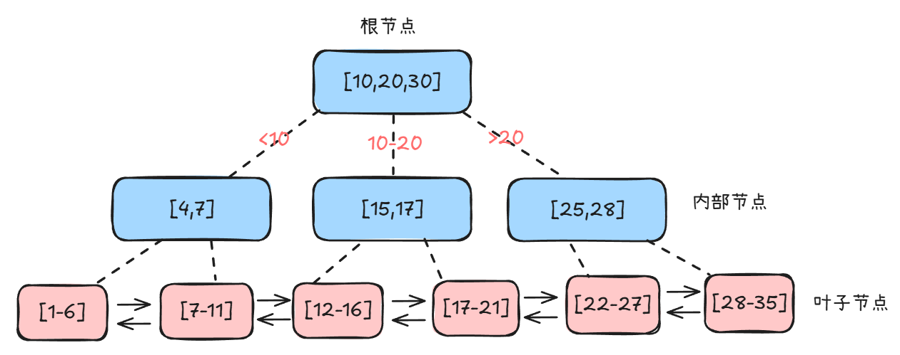

# 第6讲：索引（上）——B+树与查询加速原理

> **目标：** 理解索引原理，掌握B+树结构和索引设计

---

## 开篇：索引到底是什么？

你有没有遇到过这种情况：订单表查询慢得要命，扫了200万行。老板在旁边催，你急得满头大汗。

然后DBA过来看了一眼，加了个索引，再查一次：只扫了3行，秒出结果。

你当时肯定想：这玩意儿也太神奇了吧？索引到底是个啥？为什么这么快？

今天这一讲，我们来聊聊索引的底层原理。看完你就能理解为什么加个索引能让查询快300倍，也能知道怎么给表设计合理的索引。


## 准备工作：创建测试表

这一讲会用到orders订单表做演示，我们先把表建好。如果你只是学习理论，可以跳过这部分，直接看下面的原理讲解。

```sql
-- 创建订单表
CREATE TABLE orders (
  id BIGINT PRIMARY KEY AUTO_INCREMENT COMMENT '订单ID',
  user_id BIGINT NOT NULL COMMENT '用户ID',
  status TINYINT NOT NULL DEFAULT 0 COMMENT '订单状态：0待支付 1已支付 2已完成',
  amount DECIMAL(10,2) NOT NULL COMMENT '订单金额',
  created_at DATETIME NOT NULL COMMENT '创建时间',
  updated_at DATETIME NOT NULL DEFAULT CURRENT_TIMESTAMP ON UPDATE CURRENT_TIMESTAMP COMMENT '更新时间'
) ENGINE=InnoDB DEFAULT CHARSET=utf8mb4 COMMENT='订单表';

-- 插入一些测试数据（可选，后面实战案例会插入1000万条）
INSERT INTO orders(user_id, status, amount, created_at) VALUES
(10001, 1, 99.99, '2025-12-25 10:30:00'),
(10001, 2, 199.99, '2025-12-25 14:20:00'),
(10001, 0, 99.99, '2025-12-24 09:15:00');
```

**说明：** 这个表会在后面的"实战案例"章节用到，到时候会插入1000万条数据做性能测试。现在先建好表，插入几条数据就够了。

---

## 一、索引是什么？用字典来理解

**一句话定义：** 索引是帮助MySQL高效获取数据的数据结构。

想象一下查字典：

**没索引：** 一本1000页的字典，找"张三"这个字，你得从第1页翻到第1000页，一页页找。

**有索引：** 打开目录，找拼音"Z"，直接定位到第850页，几秒就找到了。

MySQL的索引就是这个道理。10万条数据的表，有无索引查询速度相差300倍以上。

### 索引的本质

索引是一种数据结构，MySQL用的是**B+树**。它就像一本书的目录，记录了"数据在哪里"，查询时直接跳到对应位置，不用从头到尾扫一遍。

---

## 二、为什么选B+树？

你可能会问：数据结构那么多，为啥偏偏选B+树？哈希表、二叉树不行吗？

### 1. 哈希表不行吗？

哈希表查询O(1)最快，但只支持等值查询。

```sql
-- 哈希索引可以
WHERE id = 1001

-- 哈希索引不行（范围查询、排序）
WHERE age > 18
ORDER BY salary DESC
```

**原因：** 哈希表存储无序，无法支持范围查询和排序。

### 2. 二叉树不行吗？

数据量大时，二叉树会变得很高。100万条数据，二叉树高度可能达到20层。

每层需要1次磁盘IO，20层就是20次IO。即使有缓存优化，树太高也会严重影响性能。磁盘IO是数据库最慢的操作（机械硬盘约10ms/次，SSD约0.1-0.2ms/次）。

### 3. B树也可以，为什么偏偏B+树？

你可能会问：B树也是矮胖树，为什么MySQL不用B树，偏偏要用B+树？

**B树 vs B+树的结构差异：**

| 对比项 | B树 | B+树 | 谁更好？ |
|-------|-----|------|---------|
| **数据存储位置** | 分散在各层节点 | 只在叶子节点 | B+树 |
| **非叶子节点大小** | 大（存索引+数据） | 小（只存索引） | B+树 |
| **单个节点能存多少索引** | 少（因为还要存数据） | 多（只存索引） | B+树 |
| **树的高度** | 相对高 | 相对矮 | B+树 |
| **范围查询** | 需要中序遍历，跨层查找 | 叶子节点链表遍历 | B+树 |
| **单点查询** | 可能更快（数据在上层） | 稳定（都要到叶子） | B树略优 |
| **磁盘IO次数** | 不稳定（1-3次） | 稳定（3次） | B+树 |


**B+树的优势：**

**优势1：范围查询更快**
```sql
-- 查询 WHERE id BETWEEN 10 AND 30
-- B树：需要中序遍历，跨层查找，复杂
-- B+树：找到起始节点，沿着链表遍历，简单
```

**优势2：树更矮，IO更少**
- B树：非叶子节点存数据，一个节点只能存100个索引
- B+树：非叶子节点只存索引，一个节点能存1000个索引
- 结果：B+树高度更矮，查询IO更少

**优势3：查询性能稳定**
- B树：数据在不同层，查询次数不稳定（1-3次IO）
- B+树：数据都在叶子节点，查询次数稳定（3次IO）

**优势4：更适合磁盘存储**
- 顺序IO（链表遍历）比随机IO快
- 预读机制友好（一次读一个节点页）
- 缓存命中率高（根节点常驻内存）

### 4. B+树的页结构：为什么3层能存千万数据？

很多人好奇：为什么B+树3-4层就能存千万数据？关键在于**页（Page）**的设计。

**什么是页？**

页是InnoDB存储数据的最小单位，默认大小16KB。B+树的每个节点就是一个页。

**页的结构（默认大小16KB）：**


**说明：** 如果你对一页为什么16kb感兴趣，可以阅读这篇文章：[InnoDB选择16kb的原因](https://juejin.cn/post/7564732926932975616)

**一个页能存多少数据？**

**非叶子节点（只存索引）：**
- 假设索引字段是BIGINT（8字节）+ 页指针（6字节）= 14字节
- 一个页16KB = 16384字节
- 可存储：16384 / 14 ≈ 1170个索引

**叶子节点（存完整数据）：**
- 假设一行数据1KB（包含多个字段）
- 一个页16KB可存储：16KB / 1KB = 16行

**3层B+树能存多少数据？**

```
第1层（根节点）：1个页，1170个索引
第2层（内部节点）：1170个页，每页1170个索引 = 1,368,900个索引
第3层（叶子节点）：1,368,900个页，每页16行 = 21,902,400行数据
```

**结论：** 3层B+树可以存储约2190万行数据！

**为什么查询这么快？**

1. **根节点常驻内存**：第1层不需要磁盘IO
2. **只需2-3次IO**：查询任意数据只需访问2-3个页
3. **顺序IO友好**：范围查询沿着链表遍历，顺序读取

**实际案例：**
- 1000万行数据，B+树高度3层
- 查询单条数据：2次磁盘IO（根节点在内存）
- 机械硬盘：2 × 10ms = 20ms
- SSD：2 × 0.1ms = 0.2ms



**B+树结构说明：**

B+树是一棵倒置的树，分为三层：

**第1层（根节点）：** 存储索引值 [10, 20, 30]，用于快速定位数据在哪个分支

**第2层（内部节点）：** 存储更细粒度的索引值
- 左节点 [4, 7]：管理小于10的数据
- 中节点 [15, 17]：管理10-20之间的数据  
- 右节点 [25, 28]：管理大于20的数据

**第3层（叶子节点）：** 存储完整的数据行
- 每个叶子节点是一个16KB的页，包含多行数据
- 比如：节点1包含id=1,2,3的数据行，节点2包含id=7,8,9的数据行
- 叶子节点之间用双向链表连接，支持范围查询

**关键特点：**
- 非叶子节点只存索引，不存数据
- 所有数据都在叶子节点（一个节点页包含多行数据）
- 叶子节点形成链表，范围查询只需遍历链表
- 千万级数据，树高只有3-4层，查询只需3-4次磁盘IO

---

## 三、聚簇索引 vs 二级索引

InnoDB的索引分两类，这决定了查询效率。

### 1. 聚簇索引（主键索引）

**特点：** 索引和数据存在一起，找到索引就找到了完整数据。

**唯一性：** 一张表只有一个聚簇索引（主键）。

```sql
-- 查询主键，直接在聚簇索引树找到完整数据
SELECT * FROM orders WHERE id = 1;
-- 扫描行数：1行
```

### 2. 二级索引（辅助索引）

**特点：** 叶子节点存的是主键ID，不是完整数据。

**查询流程：**
1. 在二级索引树找到主键ID
2. 拿着主键ID去聚簇索引树查完整数据（回表）

```sql
-- user_id有二级索引
SELECT * FROM orders WHERE user_id = 10001;
-- 流程：二级索引找到3个主键ID → 回表3次查完整数据
-- 扫描行数：3行（多了回表开销）
```


**回表代价：**
- 二级索引查询 = 索引查询 + N次回表
- 如果匹配行数太多，回表代价高，优化器可能放弃索引，直接全表扫描

**怎么解决回表问题？**

有两个办法：
1. 缩小查询范围，减少回表次数
2. 使用覆盖索引，避免回表（后面会详细讲）

---

## 四、联合索引与最左匹配原则

多个字段建一个索引，叫联合索引。

```sql
-- 创建联合索引
CREATE INDEX idx_user_status ON orders(user_id, status);
```

### 1. 什么是联合索引？

**定义：** 多个字段组合成一个索引。

**优势：**
- 节省空间：不需要建多个单列索引
- 支持多种查询：可以匹配多种WHERE条件组合
- 更容易实现覆盖索引（避免回表，后面会讲）

**示例：**
```sql
-- 联合索引
CREATE INDEX idx_user_status_time ON orders(user_id, status, created_at);

-- 可以支持以下查询（最左匹配原则）：
WHERE user_id = 10001                                    -- 用到user_id
WHERE user_id = 10001 AND status = 0                     -- 用到user_id, status
WHERE user_id = 10001 AND status = 0 AND created_at > '2024-01-01'  -- 全部用到

-- 但不能支持（跳过了最左字段user_id）：
WHERE status = 0                                         -- 索引失效
WHERE created_at > '2024-01-01'                          -- 索引失效
```

**注意：** 联合索引不等于多个单列索引。联合索引 `(a,b,c)` 只能支持以a开头的查询，不能单独用b或c。

### 2. 最左匹配原则

联合索引 `(user_id, status, created_at)` 按照字段顺序排序。

**走索引的情况：**
```sql
-- 使用user_id（最左字段）
WHERE user_id = 10001

-- 使用user_id + status（前两个字段）
WHERE user_id = 10001 AND status = 1

-- 使用全部字段
WHERE user_id = 10001 AND status = 1 AND created_at > '2024-01-01'
```

**索引失效的情况：**
```sql
-- 跳过最左字段user_id
WHERE status = 1

-- 跳过最左字段
WHERE created_at > '2024-01-01'

-- 只用到user_id，status和created_at用不上（中间断层）
WHERE user_id = 10001 AND created_at > '2024-01-01'
```

**原理：** 联合索引先按user_id排序，user_id相同的再按status排序。如果跳过user_id，status的顺序是乱的，无法使用索引。

### 3. 特殊情况：范围查询后的字段

这是个容易踩坑的地方。

```sql
-- 索引：idx_abc(a, b, c)

-- a等值 + b等值 + c范围：全部用上
WHERE a = 1 AND b = 2 AND c > 100

-- a范围 + b等值：只用到a，b用不上
WHERE a > 1 AND b = 2
```

**原理：** 
- 范围查询（>、<、BETWEEN）后的字段无法使用索引
- 因为范围查询后，后面字段的顺序是乱的

**为什么顺序会乱？**

联合索引 `(a, b)` 的排序规则：先按a排序，a相同的再按b排序。

```
索引数据：
a=1, b=5
a=1, b=8
a=2, b=3
a=2, b=9
a=3, b=1
a=3, b=7
```

如果查询 `WHERE a > 1 AND b = 3`：
- a > 1 匹配：a=2,b=3 / a=2,b=9 / a=3,b=1 / a=3,b=7
- 看b的值：3, 9, 1, 7 → 顺序是乱的！
- 所以b字段无法使用索引，只能在结果中逐行过滤

**实战建议：**
- 等值条件放前面，范围条件放后面
- 如果查询条件是 `a范围 + b等值`，索引顺序应该是 `(b, a)`

**MySQL 5.6+的优化：索引下推（ICP）**

MySQL 5.6引入了索引下推（Index Condition Pushdown）优化，可以在一定程度上缓解这个问题。

**什么是ICP？**
- 没有ICP：在索引中找到匹配的记录，回表后再用WHERE条件过滤
- 有ICP：在索引中就用WHERE条件过滤，减少回表次数

**示例：**
```sql
-- 索引：idx_user_status(user_id, status)
-- 查询：WHERE user_id > 10000 AND status = 0

-- 没有ICP：
-- 1. 在索引中找到user_id > 10000的所有记录（可能1万条）
-- 2. 回表1万次，获取完整数据
-- 3. 用status = 0过滤

-- 有ICP：
-- 1. 在索引中找到user_id > 10000的记录
-- 2. 在索引中就用status = 0过滤（可能只剩100条）
-- 3. 只回表100次
```

**ICP的限制：**
- 只能用于二级索引
- 只能下推索引中包含的字段
- 不能下推函数、子查询等复杂条件

### 4. 覆盖索引：避免回表的神器

前面讲了二级索引需要回表，那有没有办法避免回表呢？有！这就是**覆盖索引**。

**定义：** 查询的字段都在索引里，不需要回表查询完整数据。

**覆盖索引 vs 联合索引：**
- 联合索引：多个字段组成一个索引（索引的结构）
- 覆盖索引：查询字段都在索引里（查询的优化技巧）
- 关系：联合索引更容易实现覆盖索引

**示例：**
```sql
-- 索引：idx_user_status(user_id, status)

-- 需要回表（查询了amount字段，不在索引里）
SELECT user_id, status, amount FROM orders WHERE user_id = 10001;
-- Extra: NULL（需要回表）

-- 不需要回表（只查索引字段）
SELECT user_id, status FROM orders WHERE user_id = 10001;
-- Extra: Using index（覆盖索引）
```

**性能对比：**
- 回表查询：索引查询 + N次回表
- 覆盖索引：只查索引，无需回表
- 性能提升：2-3倍

**如何实现覆盖索引？**

方法1：只查询索引字段
```sql
-- 只查user_id和status，都在索引里
SELECT user_id, status FROM orders WHERE user_id = 10001;
```

方法2：把查询字段都加到联合索引里
```sql
-- 查询需要user_id, status, created_at
-- 创建联合索引包含这3个字段
CREATE INDEX idx_user_status_time ON orders(user_id, status, created_at);

-- 这样查询就是覆盖索引了
SELECT user_id, status, created_at FROM orders WHERE user_id = 10001;
```

**注意：** 不要为了覆盖索引而把所有字段都加到索引里，索引太大反而影响性能。

---

## 五、索引设计原则

### 原则1：选择区分度高的字段

**区分度 = COUNT(DISTINCT 字段) / COUNT(*)**

```sql
-- 查看字段区分度
SELECT 
  COUNT(DISTINCT user_id) / COUNT(*) AS user_id区分度,
  COUNT(DISTINCT status) / COUNT(*) AS status区分度
FROM orders;
```

**结果：**
- user_id区分度：0.01（100万个不同值）
- status区分度：0.0003（只有3个值：0/1/2）

**结论：** user_id适合建索引，status不适合单独建索引。

### 原则2：联合索引字段顺序

**规则：** 区分度高的字段在前，等值查询在前，范围查询在后。

```sql
-- 好：区分度高的user_id在前
CREATE INDEX idx_user_status ON orders(user_id, status);

-- 差：区分度低的status在前
CREATE INDEX idx_status_user ON orders(status, user_id);
```

### 原则3：索引不是越多越好

**问题：**
- 每次INSERT/UPDATE/DELETE都要更新所有索引
- 写入性能下降50%以上
- 磁盘空间浪费

**建议：**
- 只给高频查询字段建索引
- 一张表索引数量控制在5个以内
- 联合索引优于多个单列索引

### 原则4：主键选择

主键选型是个有争议的话题，不同场景有不同选择。

**方案1：自增整数（单机场景）**

```sql
id BIGINT PRIMARY KEY AUTO_INCREMENT
```

**优点：**
- 占用空间小（8字节）
- 自增有序，插入时B+树不需要频繁分裂，性能好
- 二级索引存储主键，空间省

**缺点：**
- 分库分表后容易冲突（多个库都从1开始自增）
- 容易被爬虫遍历（id连续，可以猜测总量）
- 数据迁移时ID可能冲突

**方案2：雪花算法ID（分布式场景）**

```sql
id BIGINT PRIMARY KEY  -- 雪花算法生成，如：1234567890123456789
```

**优点：**
- 全局唯一，分库分表不冲突
- 趋势递增（不是严格递增），插入性能还可以
- 占用空间小（8字节）
- 包含时间戳，可以排序

**缺点：**
- 需要额外的ID生成服务
- 不是严格递增，B+树会有少量分裂

**方案3：UUID（不推荐）**

```sql
id VARCHAR(36) PRIMARY KEY  -- 如：550e8400-e29b-41d4-a716-446655440000
```

**优点：**
- 全局唯一，分库分表不冲突
- 生成简单，不需要额外服务

**缺点：**
- 占用空间大（36字节 vs 8字节）
- 完全无序，插入时B+树频繁分裂，性能差
- 二级索引存储主键，空间浪费严重
- 不可读，调试困难

**实际选型建议：**

| 场景 | 推荐方案 | 原因 |
|------|---------|------|
| 单机MySQL | 自增整数 | 性能最好，空间最省 |
| 分库分表 | 雪花算法 | 全局唯一，性能还可以 |
| 对外API | 雪花算法 | 避免暴露数据量 |
| 临时表/日志表 | 自增整数 | 简单够用 |

**大厂实践：**
- 阿里：推荐雪花算法或类似的分布式ID生成方案
- 美团：Leaf（基于雪花算法改进）
- 百度：UidGenerator（基于雪花算法）

**总结：** 单机用自增，分布式用雪花算法，别用UUID。

---

## 六、避坑指南

### 坑1：索引越多越好

**错误认知：** 给每个字段都建索引，查询就快了。

**问题：**
- 每次INSERT/UPDATE/DELETE都要更新所有索引
- 写入性能下降50%以上
- 磁盘空间浪费

**正确做法：**
- 只给高频查询字段建索引
- 一张表索引数量控制在5个以内
- 联合索引优于多个单列索引

### 坑2：联合索引字段顺序随意

**错误示例：**
```sql
-- 查询条件：WHERE user_id = ? AND status = ?
-- 但索引顺序反了
CREATE INDEX idx_status_user ON orders(status, user_id);
```

**正确做法：**
```sql
-- 区分度高的字段在前（user_id有100万种值，status只有3种值）
CREATE INDEX idx_user_status ON orders(user_id, status);
```

**原因：** 区分度高的字段在前，能更快缩小范围。

### 坑3：主键选型不当

**错误示例1：使用UUID**
```sql
CREATE TABLE orders (
  id VARCHAR(36) PRIMARY KEY,  -- UUID
  ...
);
```

**问题：**
- VARCHAR占用空间大（36字节 vs BIGINT的8字节）
- UUID完全无序，插入时B+树频繁分裂，性能下降50%以上
- 二级索引存储主键，空间浪费严重

**错误示例2：分库分表还用自增ID**
```sql
-- 库1：id从1开始
-- 库2：id也从1开始
-- 合并数据时ID冲突
```

**正确做法：**

**单机场景：**
```sql
CREATE TABLE orders (
  id BIGINT PRIMARY KEY AUTO_INCREMENT,
  ...
);
```

**分库分表场景：**
```sql
CREATE TABLE orders (
  id BIGINT PRIMARY KEY,  -- 雪花算法生成
  ...
);
```

**选型原则：** 单机用自增，分布式用雪花算法，别用UUID。

---

## 七、今天学了啥？快速回顾

### 核心概念

**索引：** 帮助MySQL高效获取数据的数据结构，本质是B+树。

**B+树：** 矮胖树，千万级数据只有3-4层，查询只需3-4次磁盘IO。

**页结构：** 每个节点是16KB的页，非叶子节点存1170个索引，叶子节点存16行数据，3层可存2190万行。

**聚簇索引：** 主键索引，索引和数据存在一起。

**二级索引：** 辅助索引，叶子节点存主键ID，需要回表。

**覆盖索引：** 查询字段都在索引里，不需要回表，性能提升2-3倍。

### 联合索引

**最左匹配原则：** 联合索引 `(a,b,c)` 相当于 `(a)`, `(a,b)`, `(a,b,c)` 三个索引。

**字段顺序：** 区分度高的在前，等值查询在前，范围查询在后。

**特殊情况：** 范围查询后的字段无法使用索引。

### 索引设计原则

1. 选择区分度高的字段
2. 联合索引优于多个单列索引
3. 索引不是越多越好（控制在5个以内）
4. 主键用自增整数，不用VARCHAR或UUID

---

## 八、常见问题

**Q1：索引是不是越多越好？**

不是。索引会占用磁盘空间，每次写入都要更新索引，索引越多写入越慢。一张表索引数量控制在5个以内。

**Q2：什么时候用联合索引，什么时候用单列索引？**

- 查询条件经常一起出现：用联合索引
- 查询条件单独出现：用单列索引
- 联合索引可以覆盖多个查询场景，优先考虑

**Q3：主键应该怎么选？**

看场景：
- 单机MySQL：用自增整数（性能最好，空间最省）
- 分库分表：用雪花算法（全局唯一，性能还可以）
- 对外API：用雪花算法（避免暴露数据量）
- 别用UUID：占用空间大，完全无序，插入性能差

大厂实践：阿里推荐雪花算法，美团用Leaf，百度用UidGenerator。

**Q4：覆盖索引是什么？怎么实现？**

查询字段都在索引里，不需要回表。实现方法：
- 只查询索引字段：`SELECT id, user_id, status`
- 或者把查询字段都加到联合索引里

**Q5：为什么有时候有索引也不走索引？**

这是索引失效的问题，下一讲会详细讲解索引失效场景和解决方案，还会教你用EXPLAIN工具分析执行计划。

---

## 九、作业

### 基础题

**第1题：** 手绘B+树结构

画出一个3层B+树，要求：
- 根节点包含3个键值（如10, 20, 30）
- 每个中间节点包含3个键值
- 叶子节点标注双向链表
- 标注查询路径：查找值为25的数据需要经过哪些节点？

**提示：** 参考本讲"B+树结构说明"部分的文字描述，用纸笔画出来，加深理解。

**第2题：** 计算B+树能存多少数据

假设：
- 索引字段BIGINT（8字节）+ 页指针（6字节）
- 一行数据500字节
- 页大小16KB

问题：
1. 非叶子节点能存多少个索引？
2. 叶子节点能存多少行数据？
3. 3层B+树能存多少行数据？

### 进阶题

**第1题：** 分析最左匹配原则

```sql
-- 已有索引：idx_user_status_time(user_id, status, created_at)
-- 分析以下查询哪些能用到索引，哪些不能，为什么？

-- A: WHERE user_id = 10001;
-- B: WHERE user_id = 10001 AND status = 0;
-- C: WHERE user_id = 10001 AND created_at > '2024-01-01';
-- D: WHERE status = 0 AND created_at > '2024-01-01';
-- E: WHERE user_id = 10001 AND status = 0 AND created_at > '2024-01-01';
```

**第2题：** 设计联合索引

```sql
-- 查询需求：查询某用户某状态的订单，按创建时间倒序
SELECT id, user_id, status, amount, created_at
FROM orders
WHERE user_id = 10001 AND status = 0
ORDER BY created_at DESC
LIMIT 10;

-- 问题：应该创建什么索引？字段顺序是什么？为什么？
```

---

## 十、下一讲预告

索引建好了，但SQL还是慢？可能是索引失效了

**第7讲：索引（下）——失效场景与优化实战**

下一讲会讲这些：
- EXPLAIN工具完整使用指南（type、key、rows、Extra等字段详解）
- 1000万数据实战案例：从全表扫描到索引优化
- 12种索引失效场景（函数、类型转换、LIKE、OR等）
- 索引优化的完整套路

**建议你提前准备：**
- 完成今天的作业，特别是手绘B+树
- 思考一下：为什么WHERE条件用了函数就会导致索引失效？
- 准备好测试环境，下一讲会有大量实战演练

---

**下一讲见！咱们一起攻克索引失效的难题！**
