# 第7讲：索引（下）——失效场景与优化实战

> **目标：** 识别索引失效场景，掌握慢查询优化方法

## 开篇：索引加了，为什么还是慢？

上一讲学完，你信心满满地给表加了索引。结果查询还是慢，EXPLAIN一看，type=ALL，索引根本没用上。

这是很多人都会遇到的坑：索引加了，但失效了。

就像你买了辆跑车，结果一直挂着一档开，速度还是上不去。不是车不行，是用法不对。

今天这一讲，我会先教你用EXPLAIN工具分析执行计划，然后用1000万数据实战演示索引优化的完整过程，最后总结12种索引失效场景。看完你就能快速定位问题，把慢查询从8秒优化到0.05秒。

## 一、准备工作：快速构造1000万测试数据

在学习EXPLAIN和索引优化之前，我们先准备一个1000万数据的订单表。这样后面讲解时，你可以跟着一起实践。

### 1. 表结构说明

**如果第六讲已经创建了orders表：**
- 建议先删除重建（`DROP TABLE orders;`）
- 原因：先导入数据再建索引，比有索引时导入快10倍以上
- 策略：裸表导数据（只有主键）→ 导入完成 → 再创建业务索引

**创建裸表（只有主键）：**
```sql
DROP TABLE IF EXISTS orders;

CREATE TABLE orders (
  id BIGINT PRIMARY KEY AUTO_INCREMENT COMMENT '订单ID',
  user_id BIGINT NOT NULL COMMENT '用户ID',
  status TINYINT NOT NULL DEFAULT 0 COMMENT '订单状态：0待支付 1已支付 2已完成',
  amount DECIMAL(10,2) NOT NULL COMMENT '订单金额',
  created_at DATETIME NOT NULL COMMENT '创建时间',
  updated_at DATETIME NOT NULL DEFAULT CURRENT_TIMESTAMP ON UPDATE CURRENT_TIMESTAMP COMMENT '更新时间'
) ENGINE=InnoDB DEFAULT CHARSET=utf8mb4 COMMENT='订单表';
```

### 2. 导入数据

**推荐方式：使用LOAD DATA命令（在Navicat查询窗口执行）**

```sql
-- 为什么用LOAD DATA？
-- 1. 直接读取文件，不走网络传输
-- 2. 批量插入，比INSERT快100倍
-- 3. MySQL官方推荐的大数据导入方式

LOAD DATA LOCAL INFILE 'D:/path/to/orders_data.csv'  -- 改为你的CSV文件路径
INTO TABLE orders
FIELDS TERMINATED BY ','      -- 字段分隔符：逗号
LINES TERMINATED BY '\n'      -- 行分隔符：换行
(user_id, status, amount, created_at);  -- 字段顺序（不包含id，自动递增）

-- 验证导入结果
SELECT COUNT(*) FROM orders;  -- 应该是10000000
```

[orders_data](/01-My-Columns/MySQL-Journey/orders_data.csv)

**参数说明：**
- `LOCAL INFILE`：从客户端读取文件（不是服务器端）
- `FIELDS TERMINATED BY ','`：CSV用逗号分隔
- `LINES TERMINATED BY '\n'`：每行一条记录
- `(user_id, status, amount, created_at)`：CSV字段顺序，id自动生成

**导入时间：** 约5分钟（1000万条数据，使用Navicat实测）

### 3. 创建索引

**数据导入完成后，再创建索引：**
```sql
-- 创建业务索引（每个索引约需60秒，共约2分钟）
ALTER TABLE orders ADD INDEX idx_user_id(user_id);
ALTER TABLE orders ADD INDEX idx_created_at(created_at);

-- 验证索引
SHOW INDEX FROM orders;
```

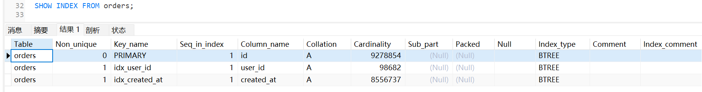

**为什么先导数据再建索引？**
- 有索引时导入：每插入一行都要维护索引，慢
- 无索引时导入：直接写入数据，快
- 导入后建索引：一次性构建索引树，比逐行维护快10倍

## 二、EXPLAIN工具完整使用指南

数据准备好了，现在来学习EXPLAIN工具。想知道SQL有没有走索引，第一步就是用EXPLAIN。

### 1. EXPLAIN基本用法

```sql
-- 在任何SELECT语句前加上EXPLAIN
EXPLAIN SELECT * FROM orders WHERE user_id = 10001;
```

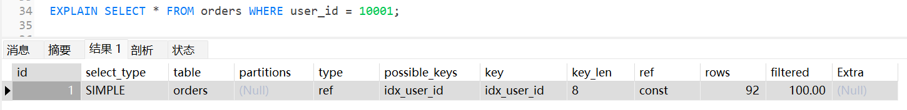

执行后会返回一张表，包含12个字段。我们先整体了解，再重点掌握核心字段。

### 2. EXPLAIN字段全览

| 字段 | 含义 | 重要程度 |
|------|------|---------|
| **id** | 查询序号，数字越大越先执行 | ⭐ |
| **select_type** | 查询类型（SIMPLE/PRIMARY/SUBQUERY等） | ⭐ |
| **table** | 查询的表名 | ⭐ |
| **partitions** | 匹配的分区（分区表才有值） | - |
| **type** | 访问类型（全表扫描/索引扫描等） | ⭐⭐⭐ 核心 |
| **possible_keys** | 可能用到的索引 | ⭐⭐ |
| **key** | 实际使用的索引 | ⭐⭐⭐ 核心 |
| **key_len** | 索引使用的字节数 | ⭐⭐ |
| **ref** | 索引关联的列或常量 | ⭐ |
| **rows** | 预估扫描行数 | ⭐⭐⭐ 核心 |
| **filtered** | 过滤后剩余数据的百分比 | ⭐ |
| **Extra** | 额外信息（是否回表、是否排序等） | ⭐⭐⭐ 核心 |

**核心字段（必须掌握）：** type、key、rows、Extra、key_len

### 3. 核心字段详解

#### 字段1：type（访问类型）⭐⭐⭐

这是最重要的字段，表示MySQL用什么方式查找数据。

| type值 | 含义 | 性能 | 示例 |
|--------|------|------|------|
| **system** | 系统表，只有一行数据 | 最快 | 查询系统表 |
| **const** | 主键或唯一索引等值查询 | 极快 | WHERE id = 1 |
| **eq_ref** | 主键或唯一索引关联查询 | 很快 | JOIN时用主键关联 |
| **ref** | 非唯一索引等值查询 | 快 | WHERE user_id = 10001 |
| **range** | 范围查询 | 合格 | WHERE id > 100 |
| **index** | 全索引扫描 | 慢 | 扫描整个索引树 |
| **ALL** | 全表扫描 | 最慢 | 没用索引 |

**性能排序（从好到坏）：**
```
system > const > eq_ref > ref > range > index > ALL
```

**优化目标：** 至少达到range，最好是ref或const。

#### 字段2：key（实际使用的索引）⭐⭐⭐

- 显示索引名称：说明用到了索引
- **NULL：没用索引，需要优化**

#### 字段3：rows（预估扫描行数）⭐⭐⭐

MySQL预估需要扫描多少行数据。

- rows=1：最理想
- rows=100：还可以
- rows=100000：需要优化
- rows=10000000：严重问题

**注意：** rows是预估值，不是实际值，但可以作为参考。

#### 字段4：Extra（额外信息）⭐⭐⭐

| Extra值 | 含义 | 优化建议 |
|---------|------|---------|
| **Using index** | 覆盖索引，不需要回表查询 | ✅ 最优（无需优化） |
| **Using index condition** | 索引下推（ICP），在索引层面过滤数据 | ✅ 良好（无需优化） |
| **Using MRR** | 多范围读优化，批量回表减少随机IO | ✅ 良好（范围查询自动优化） |
| **Using where** | 在Server层使用WHERE过滤数据 | ⚠️ 正常（可优化为覆盖索引） |
| **Using filesort** | 需要额外的排序操作（内存或磁盘） | ⚠️ 推荐优化（考虑添加排序索引） |
| **Using temporary** | 使用临时表（GROUP BY或DISTINCT） | ❌ 必须优化（性能杀手） |

#### 字段5：key_len（索引使用长度）⭐⭐

表示用到了索引的多少字节，用于判断联合索引用到了几个字段。

```sql
-- 联合索引：idx_user_status(user_id, status)
-- user_id是BIGINT（8字节），status是TINYINT（1字节）

-- 只用到user_id → key_len = 8
WHERE user_id = 10001

-- 用到user_id和status → key_len = 9
WHERE user_id = 10001 AND status = 0
```

### 4. 示例解读

回到刚才的截图，我们来解读一下：

| 字段 | 值 | 解读 |
|------|-----|------|
| id | 1 | 第1个查询 |
| select_type | SIMPLE | 简单查询，没有子查询 |
| table | orders | 查询orders表 |
| type | **ref** | ✅ 使用非唯一索引等值查询，性能良好 |
| possible_keys | idx_user_id | 可能使用idx_user_id索引 |
| key | **idx_user_id** | ✅ 实际使用了idx_user_id索引 |
| key_len | 8 | 使用了8字节（BIGINT类型） |
| ref | const | 使用常量值匹配 |
| rows | **92** | ✅ 预估只扫描92行，很少 |
| filtered | 100.00 | 100%的数据都符合条件 |
| Extra | (Null) | 没有额外信息，需要回表查询 |

**结论：** 这是一个优化良好的查询，使用了索引，只扫描92行。

### 5. 三种典型场景对比

**场景1：全表扫描（需要优化）**
```sql
EXPLAIN SELECT * FROM orders WHERE status = 0;
```

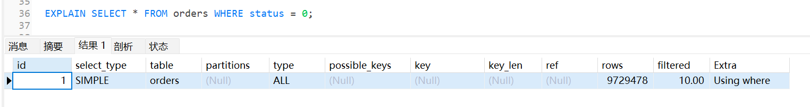

**问题：** status字段没有索引，全表扫描。

**示例2：使用索引**
```sql
EXPLAIN SELECT * FROM orders WHERE user_id = 10001;
```


**改善：** 使用索引，只扫描92行。

**示例3：覆盖索引**
```sql
-- 先创建联合索引
CREATE INDEX idx_user_status ON orders(user_id, status);

-- 查询索引包含的字段
EXPLAIN SELECT user_id, status FROM orders WHERE user_id = 10001;
```

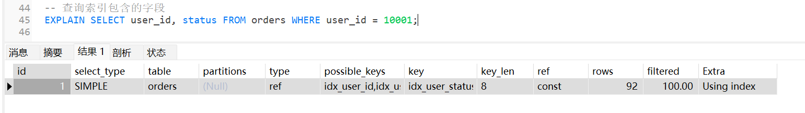

**最优：** 覆盖索引，不需要回表。

## 三、1000万数据实战案例：从全表扫描到索引优化

现在我们有了1000万数据和基础索引，来实战演练一个完整的优化过程。

### 场景：查询某日的订单

**需求：** 查询2025年6月15日的订单。

### 第1步：写出SQL（错误版本）

```sql
SELECT * FROM orders
WHERE DATE(created_at) = '2025-06-15';
```

### 第2步：EXPLAIN分析

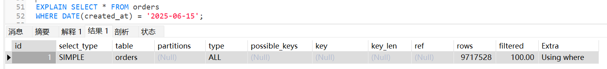

**问题诊断：**
1. type=ALL：全表扫描
2. key=NULL：没用索引
3. rows≈970万：几乎扫描全表（rows是预估值，可能略小于实际行数）
4. **原因：** created_at字段使用了DATE函数，索引失效

### 第3步：优化SQL

```sql
SELECT * FROM orders
WHERE created_at >= '2025-06-15 00:00:00' 
  AND created_at < '2025-06-16 00:00:00';
```

### 第4步：再次EXPLAIN

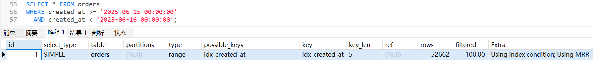

**改善：** 从扫描970万行 → 5万行，性能提升约194倍。

### 第5步：进一步优化（覆盖索引）

**问题：** 虽然用到了索引，但还需要回表查询完整数据。

**优化方案：** 创建联合索引，实现覆盖索引。

```sql
-- 创建联合索引
CREATE INDEX idx_created_amount ON orders(created_at, user_id, status);

-- 只查询需要的字段
SELECT id, user_id, status, created_at
FROM orders
WHERE created_at >= '2025-06-15 00:00:00' 
  AND created_at < '2025-06-16 00:00:00';
```

### 第6步：最终EXPLAIN

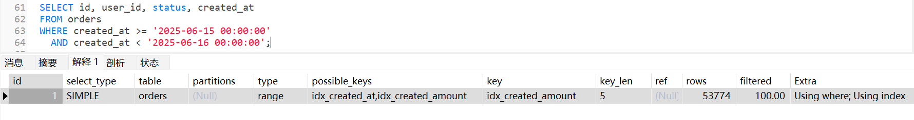

**最终效果：** 使用联合索引，减少回表次数，性能再提升2-3倍。

## 四、索引失效的12种场景

通过前面的实战，你已经看到了函数导致索引失效的案例。下面我们系统总结12种常见的索引失效场景。

### 场景1：索引字段使用函数

**错误示例：**
```sql
-- 查询2025年6月15日的订单
EXPLAIN SELECT * FROM orders WHERE DATE(created_at) = '2025-06-15';
```


**原因：** 索引树存的是原值，不是函数计算后的值。

**正确写法：**
```sql
-- 改用范围查询
EXPLAIN SELECT * FROM orders 
WHERE created_at >= '2025-06-15 00:00:00' AND created_at < '2025-06-16 00:00:00';
```


### 场景2：隐式类型转换

**用第六讲的employee表演示（name是VARCHAR类型）：**

```sql
-- 错误：字符串字段传数字，索引失效
EXPLAIN SELECT * FROM employee WHERE name = 123;
```

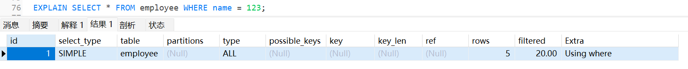

**原因：** MySQL把字段转成数字 `CAST(name AS SIGNED) = 123`，字段被函数包裹，索引失效。

**正确写法：**
```sql
-- 字符串字段一定要加引号
SELECT * FROM employee WHERE name = '123';
```

### 场景3：违反最左匹配原则

**索引：** `idx_user_status(user_id, status)`

**失效示例：**
```sql
-- 跳过最左字段user_id
EXPLAIN SELECT * FROM orders WHERE status = 0;
```

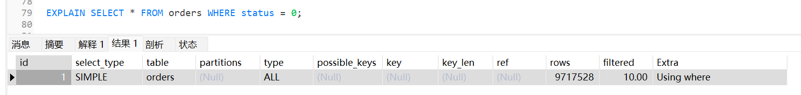

**生效示例：**
```sql
-- 使用最左字段
EXPLAIN SELECT * FROM orders WHERE user_id = 10001;

-- 使用全部字段
EXPLAIN SELECT * FROM orders WHERE user_id = 10001 AND status = 0;
```

### 场景4：LIKE左模糊

**错误示例：**
```sql
-- %在最前面
SELECT * FROM employee WHERE name LIKE '%三';

-- 两边都有%
SELECT * FROM employee WHERE name LIKE '%张三%';
```

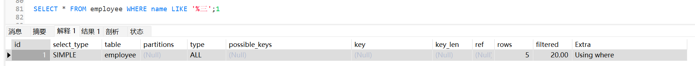

**原因：** B+树按字母序排列，前缀匹配可以快速定位，但包含匹配只能全表扫描。

**正确写法：**
```sql
-- 前缀匹配
SELECT * FROM employee WHERE name LIKE '张%';
```

**替代方案：**
- 使用全文索引（FULLTEXT,百万级以下可以用,大数据量下内存占用高、索引体积大、写入慢）
- 使用ElasticSearch等专业搜索引擎

### 场景5：OR条件两边索引不一致

**错误示例：**
```sql
-- id有索引，age没索引
SELECT * FROM employee WHERE id = 1 OR salary = 1800;
```

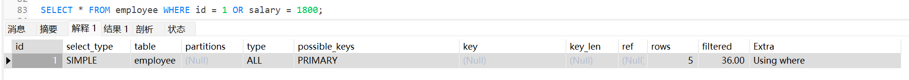

**原因：** 查id很快，但查salary要全表扫描。既然都要全表扫了，优化器直接全表扫描。

**正确写法：**
```sql
-- 方案1：给salary也加索引
CREATE INDEX idx_salary ON employee(salary);

-- 方案2：拆成两个查询用UNION
SELECT * FROM employee WHERE id = 1
UNION ALL
SELECT * FROM employee WHERE salary = 1800;
```

### 场景6：不等于操作符

**失效示例：**
```sql
SELECT * FROM orders WHERE status != 0;
SELECT * FROM orders WHERE status <> 0;
```

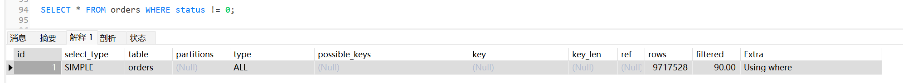

**原因：** 不等于通常匹配大部分数据。如果匹配行数超过总数的30%，优化器认为全表扫描更快。

**替代方案：**
```sql
-- 如果status只有0/1/2三种值，改用IN，具体要看区分度
SELECT * FROM orders WHERE status IN (1, 2);
```

### 场景7：IS NOT NULL

**失效示例：**
```sql
SELECT * FROM table WHERE field IS NOT NULL;
```

**原因：** 如果字段90%都有值，IS NOT NULL会匹配大部分数据，优化器放弃索引。

**注意：** IS NULL通常能走索引（如果NULL值很少）。

### 场景8：对索引字段进行运算

**错误示例：**
```sql
SELECT * FROM orders WHERE id + 1 = 1001;
SELECT * FROM orders WHERE id * 2 = 2000;
SELECT * FROM orders WHERE amount - 10 > 100;
```

**正确写法：**
```sql
SELECT * FROM orders WHERE id = 1000;
SELECT * FROM orders WHERE id = 1000;
SELECT * FROM orders WHERE amount > 110;
```

**原则：** 把运算移到等号右边。

### 场景9：字符串不加引号

**错误示例：**
```sql
-- name是VARCHAR
SELECT * FROM employee WHERE name = 202501010001;
```

**原因：** 隐式类型转换，同场景2。

**正确写法：**
```sql
SELECT * FROM employee WHERE name = '202501010001';
```

### 场景10：联合索引范围查询后的字段

**索引：** `idx_user_status_time(user_id, status, created_at)`

**部分失效：**
```sql
-- status是范围查询，导致created_at无法使用索引
SELECT * FROM orders 
WHERE user_id = 10001 AND status > 0 AND created_at > '2025-01-01';
-- 实际只用到了 user_id 和 status，created_at被截断
```

**原因：** 联合索引中，范围查询（>、<、BETWEEN）会截断后面的字段。

**优化：** 根据查询场景调整索引字段顺序，把范围查询字段放最后。

```sql
-- 如果created_at经常做范围查询，调整索引顺序
CREATE INDEX idx_user_status_time(user_id, status, created_at);
-- 同时把status改成等值查询
WHERE user_id = 10001 AND status = 1 AND created_at > '2025-01-01';

-- 如果status经常做范围查询，索引设计为
CREATE INDEX idx_user_time_status(user_id, created_at, status);
```

**设计原则：** 等值查询字段在前，范围查询字段在后。

### 场景11：IN的值过多

**失效示例：**
```sql
SELECT * FROM orders WHERE user_id IN (1,2,3,...,5000);
```

**原因：** 5000个值 = 5000次索引查找 + 5000次回表，优化器评估成本高于全表扫描。

**优化：**
- 分批查询（每批500个）
- 使用临时表JOIN

### 场景12：数据分布不均

**场景：**
```sql
-- status字段：0占95%，1占4%，2占1%
SELECT * FROM orders WHERE status = 0;
```

**现象：** 即使status有索引，查询status=0也会全表扫描。

**原因：** 匹配95%的数据，优化器认为全表扫描更快。

**结论：** 这不是问题，全表扫描确实更快，无需优化。


## 五、索引优化套路总结

学完EXPLAIN工具、实战案例和12种失效场景，我们来总结一套完整的优化套路。遇到慢查询时，按这个流程走一遍，基本都能解决。

### 第1步：定位慢SQL

**开启慢查询日志：**
```sql
-- 查看当前配置
SHOW VARIABLES LIKE 'slow_query%';
SHOW VARIABLES LIKE 'long_query_time';

-- 开启慢查询日志
SET GLOBAL slow_query_log = 'ON';
SET GLOBAL long_query_time = 1;  -- 超过1秒记录

-- 查看日志文件位置
SHOW VARIABLES LIKE 'slow_query_log_file';
```

**日志内容示例：**

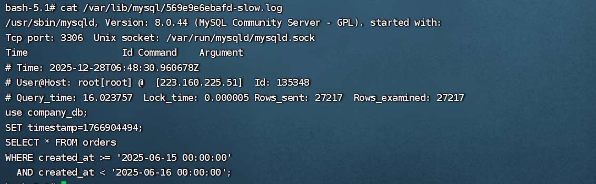

关键指标：Query_time（执行时间）、Rows_examined（扫描行数）。

### 第2步：EXPLAIN分析

```sql
EXPLAIN SELECT * FROM orders WHERE DATE(created_at) = '2025-06-15';
```

**关注5个核心指标：**
- type：至少达到range，ALL就是全表扫描
- key：NULL表示没用索引
- rows：预估扫描行数，越小越好
- Extra：Using index最优，Using filesort/temporary需要优化
- key_len：判断联合索引用到了几个字段

### 第3步：对照失效场景

快速检查清单：
- [ ] 索引字段用了函数？（DATE/YEAR/LENGTH等）
- [ ] 隐式类型转换？（字符串字段没加引号）
- [ ] 违反最左匹配？（联合索引跳过了左边字段）
- [ ] LIKE左模糊？（'%xxx'）
- [ ] OR两边索引不一致？
- [ ] 对索引字段做运算？（id + 1 = 100）

### 第4步：改写SQL

```sql
-- 函数 → 范围查询
WHERE DATE(created_at) = '2025-06-15'
→ WHERE created_at >= '2025-06-15' AND created_at < '2025-06-16'

-- 运算移到右边
WHERE id + 1 = 1001 → WHERE id = 1000

-- 不等于 → IN
WHERE status != 0 → WHERE status IN (1, 2)
```

### 第5步：优化索引设计

**设计原则：**
1. 高频查询字段建索引
2. 区分度高的字段优先（区分度 > 0.1）
3. 等值查询字段在前，范围查询字段在后
4. 尽量覆盖索引，减少回表

```sql
-- 查询：WHERE user_id = ? AND status = ? ORDER BY created_at DESC
-- 索引：
CREATE INDEX idx_user_status_time ON orders(user_id, status, created_at);
```

### 第6步：验证效果

```sql
-- 优化前后对比EXPLAIN结果
EXPLAIN SELECT ...;  -- 对比type、key、rows

-- 实际执行时间对比
SELECT ...;  -- 记录耗时变化
```


## 六、避坑指南
- 写入性能下降（每次INSERT/UPDATE要维护多个索引）
- 磁盘空间浪费
- 优化器可能选错索引

**正确做法：**
- 分析慢查询日志，找出TOP10慢SQL
- 针对性优化高频查询
- 一张表索引数量控制在5个以内

### 坑3：忽略统计信息更新

**问题：** 索引明明存在，优化器却不用。

**原因：** 统计信息过时，优化器评估不准确。

**解决：**
```sql
ANALYZE TABLE orders;
```

**建议：** 数据量变化超过10%时，执行ANALYZE TABLE。

## 七、今天学了啥？快速回顾

### EXPLAIN工具

**5个核心字段：**
- type：访问类型，至少达到range
- key：实际使用的索引，NULL表示没用索引
- rows：预估扫描行数，越小越好
- Extra：Using index最好（覆盖索引）
- key_len：判断联合索引用到几个字段

### 12种索引失效场景

1. 索引字段使用函数
2. 隐式类型转换
3. 违反最左匹配原则
4. LIKE左模糊
5. OR条件两边索引不一致
6. 不等于操作符
7. IS NOT NULL
8. 对索引字段进行运算
9. 字符串不加引号
10. 联合索引范围查询后的字段
11. IN的值过多
12. 数据分布不均

### 优化套路

1. 用EXPLAIN定位问题
2. 识别索引失效场景
3. 改写SQL
4. 创建合适的索引
5. 实现覆盖索引
6. 验证优化效果

## 八、作业

### 基础题

**第1题：** 分析以下SQL的索引失效原因，并给出优化方案：

```sql
-- A. 查询2025年的订单
SELECT * FROM orders WHERE YEAR(created_at) = 2025;

-- B. 查询手机号
SELECT * FROM user WHERE phone = 13800138000;

-- C. 模糊查询
SELECT * FROM user WHERE name LIKE '%张%';

-- D. 不等于查询
SELECT * FROM orders WHERE status != 0;
```

**第2题：** 用EXPLAIN分析项目中的3条慢SQL，记录type、key、rows、Extra字段。

### 进阶题

**第1题：** 慢查询优化实战

```sql
-- 订单表：1000万条数据
-- 查询某用户某状态的订单，按金额倒序
SELECT * FROM orders
WHERE user_id = 10001 AND status IN (0, 1)
ORDER BY amount DESC
LIMIT 10;
```

**任务：**
- 用EXPLAIN分析问题
- 设计索引方案
- 改写SQL（如果需要）
- 给出优化前后的性能对比

**第2题：** 索引设计方案

```sql
-- 商品表：500万条数据
CREATE TABLE products (
  id BIGINT PRIMARY KEY AUTO_INCREMENT,
  category_id INT NOT NULL,
  brand_id INT NOT NULL,
  name VARCHAR(200) NOT NULL,
  price DECIMAL(10,2) NOT NULL,
  stock INT NOT NULL,
  status TINYINT NOT NULL,  -- 0下架 1上架
  created_at DATETIME NOT NULL
) ENGINE=InnoDB;

-- 高频查询场景：
-- 1. 按类目+品牌查询上架商品，按价格排序
SELECT * FROM products
WHERE category_id = 10 AND brand_id = 5 AND status = 1
ORDER BY price DESC
LIMIT 20;

-- 2. 按类目查询上架商品，按创建时间倒序
SELECT * FROM products
WHERE category_id = 10 AND status = 1
ORDER BY created_at DESC
LIMIT 20;

-- 3. 按品牌查询库存不足的商品
SELECT * FROM products
WHERE brand_id = 5 AND stock < 10;
```

**任务：**
- 设计索引方案（最多3个索引）
- 说明每个索引的字段顺序及原因
- 分析每个查询会用到哪个索引

## 九、下一讲预告

索引优化完了，SQL还是慢？

可能是MySQL架构层面的问题。一条SQL从客户端发送到MySQL，经过了哪些组件？优化器是怎么选择索引的？Buffer Pool是什么？

**第8讲：MySQL架构与存储引擎**

下一讲会讲这些：
- MySQL三层架构（连接层、服务层、存储引擎层）
- 一条SQL的完整执行流程
- InnoDB vs MyISAM对比
- Buffer Pool工作机制
- 为什么InnoDB是默认存储引擎

**建议你提前准备：**
- 完成今天的作业，特别是1000万数据的实战优化
- 每个EXPLAIN结果都截图保存，对比优化前后的差异
- 思考一下：为什么同一条SQL，有时候走索引，有时候不走？
- 准备好测试环境，下一讲会有架构层面的演示

**下一讲见！咱们一起深入MySQL架构！**
