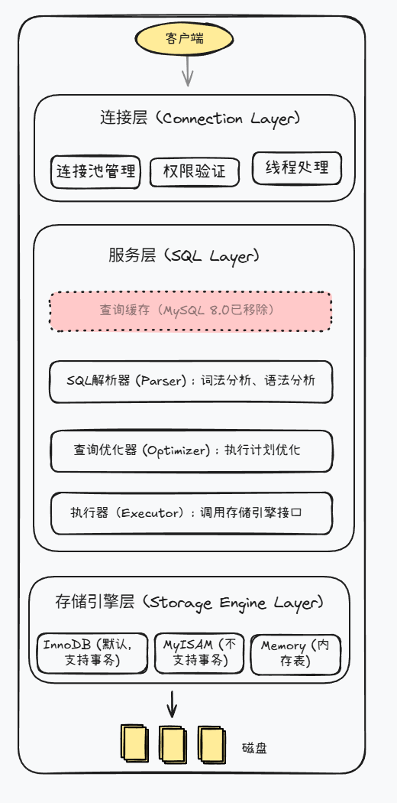

# 第8讲：MySQL架构与存储引擎

> **目标：** 理解MySQL内部架构，掌握InnoDB核心机制

## 开篇：SQL优化完了，为什么还是慢？

索引加了，SQL也改了，查询还是慢。你开始怀疑人生：还能优化啥？

这时候问题可能不在SQL层面，而在架构层面。比如Buffer Pool配置太小，命中率只有60%，大量查询都要读磁盘。

要解决这些问题，你得了解MySQL的内部架构：一条SQL从发送到返回结果，到底经过了哪些组件？Buffer Pool是怎么工作的？

今天这一讲，我们就深入MySQL内部，把架构和存储引擎搞清楚。

## 一、MySQL三层架构

MySQL分为三层：连接层、服务层、存储引擎层。



### 连接层

**功能：** 管理客户端连接、权限验证、线程分配。

MySQL是多线程架构，每个客户端连接进来，连接层会分配一个线程来处理这个连接的所有SQL请求。

```sql
-- 查看当前连接数
SHOW STATUS LIKE 'Threads_connected';

-- 查看最大连接数
SHOW VARIABLES LIKE 'max_connections';
```

**连接过程：**
1. 客户端发起TCP连接
2. 连接器验证用户名密码
3. 查询权限表，缓存该连接的权限
4. 连接建立成功

**注意：** 权限在连接建立时确定，连接期间修改权限不会生效，需要重新连接。

### 服务层

**解析器：** 词法分析和语法分析。

```sql
-- 词法分析：识别关键字
SELECT id, name FROM user WHERE id = 1;
-- 识别出：SELECT、FROM、WHERE是关键字，user是表名，id是字段名

-- 语法分析：检查语法是否正确
SELECT * FORM user;  -- 错误：FORM应该是FROM
-- 报错：You have an error in your SQL syntax
```

**优化器：** 选择最优执行计划。

```sql
-- 假设orders表有两个索引：idx_user_id 和 idx_status
SELECT * FROM orders WHERE user_id = 10001 AND status = 0;
```

优化器会评估两个索引，选择"代价"更低的那个。怎么评估？

- `idx_user_id`：user_id = 10001 可能只有几十条记录
- `idx_status`：status = 0 可能有几百万条记录（状态值就那么几种）

显然用 `idx_user_id` 扫描的行数更少，所以优化器会选它。这就是第7讲说的"区分度"——区分度高的字段，过滤效果更好。

**执行器：** 调用存储引擎接口执行SQL。

执行器拿到优化器的执行计划后，调用存储引擎的接口获取数据。如果走索引，就调用"按索引读取"接口；如果全表扫描，就调用"顺序读取"接口。

### 一条SQL的完整执行流程

以 `SELECT * FROM orders WHERE user_id = 10001` 为例：

```
客户端发送SQL
    ↓
连接层：验证用户权限
    ↓
解析器：词法分析、语法分析，生成语法树
    ↓
优化器：发现user_id有索引，决定使用idx_user_id
    ↓
执行器：调用InnoDB的"按索引查找"接口
    ↓
InnoDB：通过B+树定位到user_id=10001的记录
        先查Buffer Pool，命中则直接返回
        未命中则从磁盘加载页到Buffer Pool，再返回
    ↓
返回结果给客户端
```

## 二、InnoDB存储引擎

InnoDB是MySQL默认存储引擎，支持事务、行锁、崩溃恢复。

### Buffer Pool（缓冲池）

**作用：** 缓存数据页和索引页，减少磁盘IO。

**工作原理：**
- MySQL启动时，分配一块内存作为Buffer Pool
- 读取数据时，先从Buffer Pool查找
- 命中则直接返回（内存读取，微秒级）
- 未命中则从磁盘读取并缓存到Buffer Pool（磁盘IO，毫秒级）

**查看Buffer Pool状态：**

```sql
-- 查看Buffer Pool配置（单位：字节）
SHOW VARIABLES LIKE 'innodb_buffer_pool_size';
-- 默认134217728（即128MB）

-- 查看Buffer Pool命中情况
SHOW STATUS LIKE 'Innodb_buffer_pool_read%';
```

**关键指标：**

| 指标 | 含义 |
|------|------|
| `Innodb_buffer_pool_read_requests` | 从Buffer Pool读取的总请求次数（逻辑读） |
| `Innodb_buffer_pool_reads` | Buffer Pool未命中，从磁盘读取的次数（物理读） |

**计算命中率：**
```
命中率 = (read_requests - reads) / read_requests × 100%
```

命中率90%以上说明性能良好，低于80%需要考虑增大Buffer Pool。

### Buffer Pool的LRU淘汰策略

Buffer Pool大小是固定的，满了就需要淘汰一些数据。淘汰谁？直觉上应该淘汰"最近最少使用"的数据，这就是LRU（Least Recently Used）算法。

**普通LRU的问题：**

假设你执行了一个全表扫描：`SELECT * FROM orders`，1000万行数据全部读入Buffer Pool，把之前缓存的热点数据全挤掉了。扫描完这些数据可能再也不用了，但热点数据没了，后续查询全要读磁盘。

**InnoDB的改进LRU：**

InnoDB把LRU链表分成两部分：young区（63%）和old区（37%）。


规则：
- 新读取的数据先放入old区头部
- 如果1秒后再次访问，才移到young区
- 淘汰时从old区尾部开始淘汰

这样全表扫描的数据只会在old区待着，1秒内扫完就被淘汰，不会污染young区的热点数据。

### 配置Buffer Pool

```sql
-- 修改配置文件 my.cnf
[mysqld]
innodb_buffer_pool_size = 4G           # 建议物理内存的50-70%
innodb_buffer_pool_instances = 4       # 多实例，减少锁竞争
```

**为什么要配置多个实例？**

Buffer Pool是共享资源，多个线程同时访问需要加锁。配置多个实例后，每个实例有独立的LRU链表和锁，线程可以并行访问不同实例，减少锁等待。每个数据页通过hash固定分配到某个实例，不会重复缓存。

### 页（Page）与Buffer Pool

页是InnoDB最小的IO单位，大小16KB。如果对页的概念不熟悉，可以回顾 [第6讲：索引（上）——B+树与查询加速原理](第6讲-索引（上）——B+树与查询加速原理.md)。

Buffer Pool缓存的就是页。读取数据时，以页为单位从磁盘加载。即使只查一行数据，也会把整个16KB的页加载进来。这是因为相邻数据很可能被一起访问（空间局部性原理），同一页的其他行数据也被缓存，后续查询可能直接命中。

### 崩溃恢复机制

还记得 [第5讲：事务——数据一致性的保护伞](第5讲-事务——数据一致性的保护伞.md) 事务的持久性吗？**Undo Log 管回滚（原子性），Redo Log 管不丢（持久性）**。

**问题：** Buffer Pool里的数据修改了，还没来得及写入磁盘，MySQL突然宕机，数据丢了吗？

**不会丢。** 修改数据时，InnoDB会先写redo log，再修改Buffer Pool。即使宕机，重启后也能从redo log恢复。

**崩溃恢复流程：**
1. MySQL重启，读取redo log
2. 重做所有已提交但未写入磁盘的事务（保证持久性）
3. 根据undo log回滚所有未提交的事务（保证原子性）

> redo log和undo log的底层细节会在第9讲详细展开。

### InnoDB vs MyISAM

| 特性 | InnoDB | MyISAM |
|------|--------|--------|
| **事务** | ✅ 支持 | ❌ 不支持 |
| **锁粒度** | 行锁 | 表锁 |
| **崩溃恢复** | 自动恢复 | 需手动修复 |
| **MVCC** | ✅ 支持 | ❌ 不支持 |

**为什么InnoDB是默认存储引擎？**

MySQL 5.5之前默认是MyISAM，5.5之后改成了InnoDB。原因很简单：

1. **事务支持**：现代应用几乎都需要事务，转账、下单、库存扣减都离不开
2. **行锁**：高并发场景下，表锁会成为瓶颈，行锁性能好得多
3. **崩溃恢复**：InnoDB通过redo log自动恢复，MyISAM崩溃后可能数据损坏
4. **MVCC**：读写不冲突，并发性能更好

**如何选择？**

绝大多数场景用InnoDB。少数场景可以考虑MyISAM：纯只读的归档表、日志表（丢了能接受）、临时统计表。

MySQL 8.0已经把系统表都改成InnoDB了，MyISAM使用场景越来越少。

## 三、避坑指南

### 坑1：Buffer Pool配置过大

```sql
-- 服务器16GB内存，配置Buffer Pool 14GB
innodb_buffer_pool_size = 14G
```

**问题：** 操作系统和其他进程没有足够内存，发生内存交换（swap）。swap是把内存数据换到磁盘，访问速度从微秒级降到毫秒级，性能断崖式下降。

**正确做法：** 预留30-50%内存给操作系统。

### 坑2：MySQL重启后查询变慢

**场景：** MySQL重启后，前几分钟查询特别慢，过一会儿又正常了。

**原因：** 重启后Buffer Pool是空的，所有查询都要从磁盘加载数据。

**解决：** 开启Buffer Pool预热。

```sql
[mysqld]
innodb_buffer_pool_dump_at_shutdown = 1
innodb_buffer_pool_load_at_startup = 1
```

## 四、作业

### 基础题

分析下面这条SQL的执行流程，说明经过了哪些组件：

```sql
SELECT * FROM orders WHERE user_id = 10001 AND status = 1;
```

### 进阶题

在本地或测试环境执行以下SQL，查看Buffer Pool状态并计算命中率：

```sql
SHOW VARIABLES LIKE 'innodb_buffer_pool_size';
SHOW STATUS LIKE 'Innodb_buffer_pool_read%';
```

## 五、下一讲预告

第 [5讲](第5讲-事务——数据一致性的保护伞.md) 我们学了事务的ACID特性，知道了redo log管持久性、undo log管原子性。第8讲我们从架构角度看了它们在崩溃恢复中的作用。

但还有几个问题没解决：
- 多个事务同时读写，怎么保证不乱？
- 可重复读是怎么实现的？
- binlog和redo log有什么区别？

**第9讲：日志体系与MVCC并发控制**

下一讲会讲这些：
- 三大日志（redo log、undo log、binlog）的区别
- MVCC原理：为什么读写不冲突
- ReadView机制：可重复读的实现

**下一讲见！**
