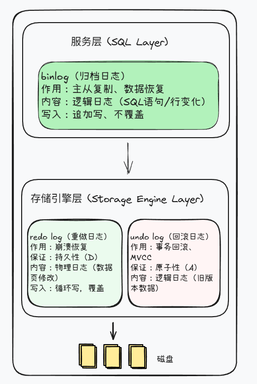
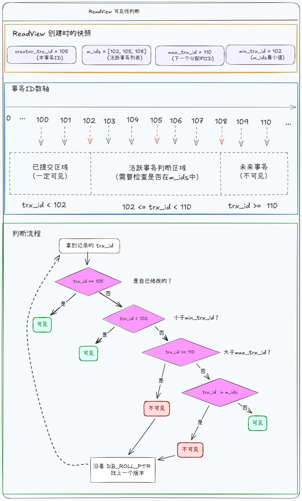

# 第9讲：日志体系与MVCC并发控制

> **目标：** 理解MySQL日志机制，掌握MVCC并发控制原理

## 开篇：把前面的知识串起来

[第5讲](第5讲-事务——数据一致性的保护伞.md) 我们学了事务的ACID特性，知道了：
- **Undo Log 管回滚（原子性）**
- **Redo Log 管不丢（持久性）**

[第8讲](第8讲-MySQL架构与存储引擎.md) 我们从架构角度看了崩溃恢复：Buffer Pool里的数据修改了，还没写入磁盘就宕机，靠redo log恢复。

但还有几个问题没解决：
- redo log、undo log、binlog三种日志到底有什么区别？
- 事务A在修改数据，事务B同时读取，为什么不会阻塞？
- 可重复读是怎么实现的？

今天这一讲，我们就把这些底层机制搞清楚。

## 一、三大日志体系

MySQL有三种核心日志：redo log、undo log、binlog。



### 1.1 redo log（重做日志）

**作用：** 保证事务的持久性（Durability）。

还记得[第5讲](第5讲-事务——数据一致性的保护伞.md)说的吗？**Redo Log 管不丢（持久性）**。[第8讲](第8讲-MySQL架构与存储引擎.md)也提到，Buffer Pool里的数据修改了，还没写入磁盘就宕机，靠redo log恢复。

现在我们来看看redo log的底层机制。

**原理：** WAL（Write-Ahead Logging）机制，先写日志，再写磁盘。

**为什么需要redo log？**

事务提交时，如果每次都把数据页刷到磁盘，性能太差（随机IO）。redo log是顺序写，先把修改记录写到redo log，事务就算提交成功了。后台线程再慢慢把数据页刷到磁盘。

**循环写机制：**

redo log 是固定大小的文件组，循环使用：


- **write pos**：当前写入位置，顺时针移动
- **checkpoint**：刷盘进度位置，顺时针移动
- **深色区域**（write pos → checkpoint）：已写入的日志，数据还没落盘，不能覆盖
- **浅色区域**（checkpoint → write pos）：数据已落盘，可以写入新日志

write pos 一直追着 checkpoint 跑。当 write pos 追上 checkpoint，说明没有可写空间了，必须暂停，等后台线程刷脏页，checkpoint 才能往前推进。

```sql
-- 查看redo log配置
SHOW VARIABLES LIKE 'innodb_log%';
```

**redo log刷盘策略（innodb_flush_log_at_trx_commit）：**

| 值 | 行为 | 安全性 | 推荐 |
|---|------|--------|------|
| 0 | 每秒刷一次 | 可能丢1秒数据 | 不推荐 |
| 1 | 每次提交都刷盘 | 最安全 | 生产推荐 |
| 2 | 提交时写OS缓存，每秒刷盘 | 可能丢1秒数据 | 折中 |

### 1.2 undo log（回滚日志）

**作用：** 保证事务的原子性（Atomicity）+ 实现MVCC。

[第5讲](第5讲-事务——数据一致性的保护伞.md)说过：**Undo Log 管回滚（原子性）**。现在我们来看它的另一个重要作用：实现MVCC。

**两个用途：**

1. **事务回滚**：每次修改前，先把旧值记到 undo log。ROLLBACK 时沿着版本链逆序恢复。
2. **MVCC**：提供数据的历史版本，配合 ReadView 判断可见性（见第三节）

```sql
-- 查看undo log配置
SHOW VARIABLES LIKE 'innodb_undo%';
```

### 1.3 binlog（归档日志）

**作用：** 主从复制、数据恢复。

**binlog vs redo log：**

| 特性 | redo log | binlog |
|------|----------|--------|
| 层级 | InnoDB引擎层 | Server层 |
| 作用 | 崩溃恢复 | 主从复制 |
| 内容 | 物理日志 | 逻辑日志 |
| 写入 | 循环写 | 追加写 |

**binlog格式：**

| 格式 | 说明 | 推荐 |
|------|------|------|
| STATEMENT | 记录SQL语句 | 不推荐（NOW()等函数会导致主从不一致） |
| ROW | 记录每行变化 | 生产推荐 |
| MIXED | 混合模式 | 不推荐 |

**查看binlog：**

```sql
-- 查看binlog文件列表
SHOW BINARY LOGS;

-- 查看binlog事件
SHOW BINLOG EVENTS IN 'mysql-bin.000001' LIMIT 20;
```

**binlog刷盘策略（sync_binlog）：**

| 值 | 行为 | 推荐 |
|---|------|------|
| 0 | 由OS决定 | 不推荐 |
| 1 | 每次提交都刷盘 | 生产推荐 |

> **生产环境推荐双1配置：** `innodb_flush_log_at_trx_commit=1` + `sync_binlog=1`

## 二、两阶段提交

**问题：** redo log和binlog是两个独立的日志，如何保证一致性？


**崩溃恢复逻辑：**

| 崩溃时机 | redo log状态 | binlog状态 | 恢复操作 |
|---------|-------------|-----------|---------|
| redo log写入前 | 无记录 | 无记录 | 无需处理 |
| redo log写入后，binlog写入前 | prepare | 无记录 | 回滚 |
| binlog写入后 | prepare | 有记录 | 提交 |

**核心判断：** binlog有记录就提交，没记录就回滚。

## 三、MVCC多版本并发控制

前面讲了 undo log 的两个用途：事务回滚和MVCC。现在来看 MVCC 是怎么工作的。

**问题：** 事务A在修改数据，事务B同时读取，为什么不会阻塞？

**答案：** MVCC（Multi-Version Concurrency Control）让读操作读取历史版本，不需要等待写操作完成。

MVCC 的实现依赖三个东西：**隐藏字段 + undo log版本链 + ReadView**。

### 3.1 隐藏字段

InnoDB为每行数据添加了隐藏字段（无法通过SQL查询）：

| 字段 | 作用 |
|------|------|
| DB_TRX_ID | 最后修改该行的事务ID |
| DB_ROLL_PTR | 回滚指针，指向undo log中的旧版本 |
| DB_ROW_ID | 隐藏主键（仅当表没有主键时） |

### 3.2 undo log版本链

每次修改数据，旧版本通过 DB_ROLL_PTR 串成链表，这就是版本链。


有了版本链，历史版本都能找到。但问题来了：**哪个版本对当前事务可见？** 这就需要 ReadView。

### 3.3 ReadView（读视图）

**作用：** 判断版本链中哪个版本对当前事务可见。

**ReadView包含4个字段：**
- **m_creator_trx_id**：创建ReadView的事务ID
- **m_ids**：当前活跃的事务ID列表（已开始但未提交）
- **m_up_limit_id**：m_ids中的最小值
- **m_low_limit_id**：下一个要分配的事务ID



核心逻辑：沿着版本链逐个判断，找到第一个可见的版本。

### 3.4 RC vs RR：ReadView的生成时机

理解了 ReadView，RC 和 RR 的区别就很简单了：**ReadView 什么时候生成？**

**场景：** 初始 age=10，事务A两次SELECT之间，事务B把age改成20并提交

| 时间 | 操作 | RC（读已提交） | RR（可重复读） |
|-----|------|---------------|---------------|
| T1 | 事务A BEGIN | - | - |
| T2 | 事务A SELECT | 生成ReadView，读到10 | 生成ReadView，读到10 |
| T3 | 事务B UPDATE+COMMIT | age变成20 | age变成20 |
| T4 | 事务A SELECT | 生成新ReadView，读到20 | 复用ReadView，读到10 |
| 结果 | | 不可重复读 ❌ | 可重复读 ✅ |

**核心区别：** RC每次SELECT都生成新ReadView，RR只在第一次SELECT时生成，之后复用。

### 3.5 快照读 vs 当前读

前面说的都是普通 SELECT，走 MVCC 读历史版本，这叫**快照读**。

但有些操作必须读最新数据，比如 UPDATE。如果 UPDATE 也读历史版本，就会丢失其他事务的修改。这类操作叫**当前读**。

| 类型 | SQL | 读取版本 | 是否加锁 |
|------|-----|---------|---------|
| 快照读 | `SELECT ...` | 历史版本（走MVCC） | 不加锁 |
| 当前读 | `SELECT ... FOR UPDATE`、`UPDATE`、`DELETE`、`INSERT` | 最新版本 | 加锁 |

**场景对比：** 初始数据 age=10，RR隔离级别

| 事务A | 事务B | 说明 |
|-------|-------|------|
| BEGIN; | | |
| SELECT age; → 读到10 | | 快照读，生成ReadView |
| | UPDATE age=20; COMMIT; | age变成20 |
| SELECT age; → 读到10 | | 快照读，复用ReadView |
| UPDATE age=age+1; | | 当前读，读到20，更新为21 |
| SELECT age; → 读到21 | | 快照读，但自己改的能看到 |
| COMMIT; | | |

**关键点：** 
- 普通SELECT是快照读，读的是ReadView生成时的版本
- UPDATE是当前读，读取最新版本（否则会丢失事务B的修改）

## 四、避坑指南

### 坑1：长事务导致undo log膨胀

事务不提交，undo log无法清理，磁盘空间持续增长。

```sql
-- 查询长事务
SELECT trx_id, trx_started, trx_query
FROM information_schema.innodb_trx
WHERE TIME_TO_SEC(TIMEDIFF(NOW(), trx_started)) > 60;
```

### 坑2：binlog格式使用STATEMENT

NOW()、UUID()等函数在主从执行结果不同，导致数据不一致。改用ROW格式。

### 坑3：刷盘策略配置为0

可能丢失数据。生产环境使用双1配置。

## 五、作业

### 基础题

查看你的MySQL日志配置：

```sql
SHOW VARIABLES LIKE 'innodb_flush_log_at_trx_commit';
SHOW VARIABLES LIKE 'sync_binlog';
SHOW VARIABLES LIKE 'binlog_format';
```

### 进阶题

RR隔离级别下，分析以下场景，事务A每次SELECT读到的age分别是多少？

初始数据：age=10

| 事务A | 事务B | 事务A读到的age |
|-------|-------|---------------|
| BEGIN; | | |
| SELECT age; | | ? |
| | UPDATE age=20; COMMIT; | |
| SELECT age; | | ? |
| UPDATE age=age+1; | | |
| SELECT age; | | ? |
| COMMIT; | | |

提示：区分快照读和当前读。

## 六、下一讲预告

日志和MVCC搞清楚了，但还有个问题：库存100件，为什么卖出了120件？订单系统频繁死锁怎么办？

**第10讲：并发场景优化——锁机制与死锁解决**

下一讲会讲：
- MySQL锁机制：全局锁、表锁、行锁、间隙锁
- 死锁产生原因与排查方法
- 库存超卖问题的解决方案

**下一讲见！**
